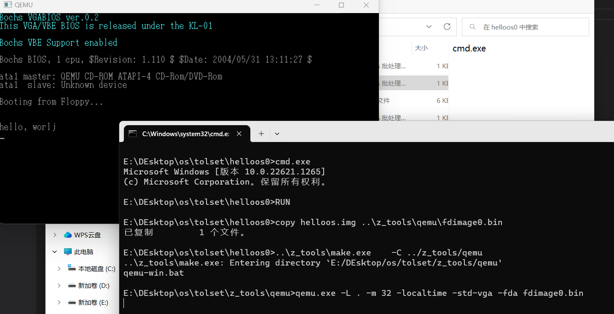
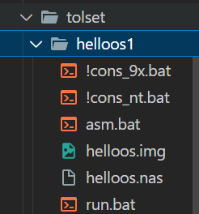

# 第一天

## 1.1动手操作

下载一个二进制编辑器 
http://www.vcraft.jp/soft/bz.html

然后进行二进制编辑

从000000到168000除了下面个别指出的地方，剩下均为0

也就是说软盘大小为1440KB


将该二进制保存为helloos.img

同时需注意书中自带tolset


依据下列目录树构建程序


run.bat内容：

```bat
copy helloos.img ..\z_tools\qemu\fdimage0.bin
..\z_tools\make.exe    -C ../z_tools/qemu
```

install.bat内容

```bat
..\z_tools\imgtol.com w a: helloos.img
```


至此，运行run.bat即可成功运行




## 1.2究竟做了什么

> cpu是集成电路板，转换电信号
>
> 二进制数与电信号一一对应

要是C编译器太贵了买不起，也不用郁闷。

即使没有C编译器，我们也可以用二进制编辑器做出一个与编译器生成文件完全一样的执行文件，而且就连C编译器本身都可以用二进制编辑器做出来。

## 1.3汇编实现

>使用的**汇编语言编译器是笔者自己开发的**，名为“**nask**”，
>
>其中的很多语法都模仿了自由软件里享有盛名的汇编器“NASM”，
>
>不过在“NASM”的基础之上又提高了自动优化能力


接下来用**汇编语言** 实现

跟刚才用**16进制编译器**所做的**同样的**helloos.img

>DB指令是“define byte”的缩写，即往文件里直接写入1个字节
>
>DB 0x00
>
>RESB指令是“reserve byte”的略写，如果想要从现在的地址开始空出10个字节来，就可以写成RESB 10


```asm
; hello-os
; TAB=4

; 以下这段是标准FAT12格式软盘专用的代码

        DB    0xeb, 0x4e, 0x90
        DB    "HELLOIPL"      ; 启动区的名称可以是任意的字符串（8字节）
        DW    512              ; 每个扇区（sector）的大小（必须为512字节）
        DB    1                ; 簇（cluster）的大小（必须为1个扇区）
        DW    1          ; FAT的起始位置（一般从第一个扇区开始）
        DB    2          ; FAT的个数（必须为2）
        DW    224       ; 根目录的大小（一般设成224项）
        DW    2880      ; 该磁盘的大小（必须是2880扇区）
        DB    0xf0      ; 磁盘的种类（必须是0xf0）
        DW    9          ; FAT的长度（必须是9扇区）
        DW    18         ; 1个磁道（track）有几个扇区（必须是18）
        DW    2          ; 磁头数（必须是2）
        DD    0          ; 不使用分区，必须是0
        DD    2880      ; 重写一次磁盘大小
        DB    0,0,0x29        ; 意义不明，固定
        DD    0xffffffff      ;（可能是）卷标号码
        DB    "HELLO-OS   "   ; 磁盘的名称（11字节）
        DB    "FAT12   "      ; 磁盘格式名称（8字节）
        RESB  18               ; 先空出18字节

; 程序主体
        DB    0xb8, 0x00, 0x00, 0x8e, 0xd0, 0xbc, 0x00, 0x7c
        DB    0x8e, 0xd8, 0x8e, 0xc0, 0xbe, 0x74, 0x7c, 0x8a
        DB    0x04, 0x83, 0xc6, 0x01, 0x3c, 0x00, 0x74, 0x09
        DB    0xb4, 0x0e, 0xbb, 0x0f, 0x00, 0xcd, 0x10, 0xeb
        DB    0xee, 0xf4, 0xeb, 0xfd

; 信息显示部分

        DB    0x0a, 0x0a      ; 2个换行
        DB    "hello, world"
        DB    0x0a             ; 换行
        DB    0

        RESB  0x1fe-$         ; 填写0x00，直到 0x001fe
        DB    0x55, 0xaa

; 以下是启动区以外部分的输出

        DB    0xf0, 0xff, 0xff, 0x00, 0x00, 0x00, 0x00, 0x00
        RESB  4600
        DB    0xf0, 0xff, 0xff, 0x00, 0x00, 0x00, 0x00, 0x00
        RESB  1469432
```

> **TAB=4**…......．有的文本编辑器可以调整TAB键的宽度。请使用这种编辑器的人将TAB键的宽度设定成4，这样源程序更容易读


>**FAT12格式**．..（FAT12 Format）用Windows或MS-DOS格式化出来的软盘就是这种格式。我们的helloos也采用了这种格式，其中容纳了我们开发的操作系统。这个格式兼容性好，在Windows上也能用


>**启动区**．.........（boot sector）软盘第一个的扇区称为启动区。那么什么是扇区呢？计算机读写软盘的时候，并不是一个字节一个字节地读写的，而是以512字节为一个单位进行读写。因此，软盘的512字节就称为一个扇区。一张软盘的空间共有1440KB，也就是1474560字节，除以512得2880，这也就是说一张软盘共有2880个扇区。那为什么第一个扇区称为启动区呢？那是因为计算机首先从最初一个扇区开始读软盘，然后去检查这个扇区最后2个字节的内容。如果这最后2个字节不是0x55 AA，计算机会认为这张盘上没有所需的启动程序，就会报一个不能启动的错误。（也许有人会问为什么一定是0x55 AA呢？那是当初的设计者随便定的，笔者也没法解释）。如果计算机确认了第一个扇区的最后两个字节正好是0x55 AA，那它就认为这个扇区的开头是启动程序，并开始执行这个程序。


>**IPL**.........…....initial program loader的缩写。启动程序加载器。启动区只有区区512字节，实际的操作系统不像hello-os这么小，根本装不进去。所以几乎所有的操作系统，都是把加载操作系统本身的程序放在启动区里的。


同样依据目录树：



asm.bat里命令为:

```bat
..\z_tools\nask.exe helloos.nas helloos.img
```

运行结果：


