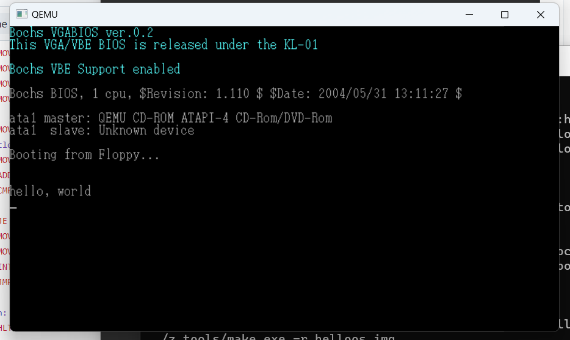

# 汇编语言学习与Makefile入门


## 2.1 简介

```asm
; hello-os
; TAB=4

        ORG      0x7c00           ; 指明程序的装载地址

        jmp   entry
; 以下这段是标准FAT12格式软盘专用的代码
        ;DB    0xeb, 0x4e
        DB    0x90
        DB    "HELLOIPL"      ; 启动区的名称可以是任意的字符串（8字节）
        DW    512              ; 每个扇区（sector）的大小（必须为512字节）
        DB    1                ; 簇（cluster）的大小（必须为1个扇区）
        DW    1          ; FAT的起始位置（一般从第一个扇区开始）
        DB    2          ; FAT的个数（必须为2）
        DW    224       ; 根目录的大小（一般设成224项）
        DW    2880      ; 该磁盘的大小（必须是2880扇区）
        DB    0xf0      ; 磁盘的种类（必须是0xf0）
        DW    9          ; FAT的长度（必须是9扇区）
        DW    18         ; 1个磁道（track）有几个扇区（必须是18）
        DW    2          ; 磁头数（必须是2）
        DD    0          ; 不使用分区，必须是0
        DD    2880      ; 重写一次磁盘大小
        DB    0,0,0x29        ; 意义不明，固定
        DD    0xffffffff      ;（可能是）卷标号码
        DB    "HELLO-OS   "   ; 磁盘的名称（11字节）
        DB    "FAT12   "      ; 磁盘格式名称（8字节）
        RESB  18               ; 先空出18字节

; 程序核心

entry:
        MOV      AX,0              ; 初始化寄存器
        MOV      SS, AX
        MOV      SP,0x7c00
        MOV      DS, AX
        MOV      ES, AX

        MOV      SI, msg
putloop:
        MOV      AL, [SI]
        ADD      SI,1              ; 给SI加1
        CMP      AL,0

        JE       fin
        MOV      AH,0x0e          ; 显示一个文字
        MOV      BX,15             ; 指定字符颜色
        INT      0x10              ; 调用显卡BIOS
        JMP      putloop
fin:
        HLT                        ; 让CPU停止，等待指令
        JMP      fin               ; 无限循环

msg:
        DB       0x0a, 0x0a       ; 换行2次
        DB       "hello, world"
        DB       0x0a              ; 换行
        DB       0

        RESB  0x1fe - ($ - $$)  ; 填写0x00，直到0x001fe
        DB    0x55, 0xaa
```


>ORG指令来源于英文“origin”，意思是“源头、起点”。它会告诉nask，程序要从指定的这个地址开始，也就是要把程序装载到内存中的指定地址。这里指定的地址是0x7c00

**从0x7c00开始到0x7dff的512个字节; 启动区的装载内容**


>可以用“JMP entry”来代替“JMP 0x7c50”，是因为entry就是0x7c50。在汇编语言中，所有标号都仅仅是单纯的数字。
>
>**每个标号对应的数字，是由汇编语言编译器根据ORG指令计算出来的。**编译器计算出的“标号的地方对应的内存地址”就是那个标号的值


>最近的BIOS功能非常多，甚至包括了电脑的设定画面，
>
>不过它的本质正如其名，就**是为操作系统开发人员准备的各种函数的集合**。而INT就是用来调用这些函数的指令。INT的后面是个数字，使用不同的数字可以调用不同的函数


>首先，既然是要显示文字，就应该看跟显卡有关的函数。这么看来，INT 0x10好像有点关系，于是在上面网页上搜索，然后就能找到以下内容（网页的原文为日语）。显示一个字符❏ AH=0x0e；❏ AL=character code；❏ BH=0；❏ BL=color code；❏ 返回值：无❏ 注：beep、退格（back space）、CR、LF都会被当做控制字符处理所以，如果大家按照这里所写的步骤，往寄存器里代入各种值，再调用INT 0x10，就能顺利地在屏幕上显示一个字符出来[插图]。


>**HLT是让CPU停止动作的指令，不过并不是彻底地停止**（如果要彻底停止CPU的动作，只能切断电源），**而是让CPU进入待机状态**。只要外部发生变化，比如按下键盘，或是移动鼠标，CPU就会醒过来，继续执行程序。


## 2.2制作启动区 与 Makefile

用nask做512字节的启动区


Makefile就像是一个非常聪明的批处理文件。

```makefile
# 默认动作

default :
	../z_tools/make.exe img

# 镜像文件生成

ipl.bin : ipl.nas Makefile
	../z_tools/nask.exe ipl.nas ipl.bin ipl.lst

helloos.img : ipl.bin Makefile
	../z_tools/edimg.exe   imgin:../z_tools/fdimg0at.tek \
		wbinimg src:ipl.bin len:512 from:0 to:0   imgout:helloos.img

# 其他指令

asm :
	../z_tools/make.exe -r ipl.bin

img :
	../z_tools/make.exe -r helloos.img

run :
	../z_tools/make.exe img
	cmd.exe /C copy helloos.img ..\z_tools\qemu\fdimage0.bin
	../z_tools/make.exe -C ../z_tools/qemu

install :
	../z_tools/make.exe img
	../z_tools/imgtol.com w a: helloos.img

clean :
	cmd.exe /C del ipl.bin
	cmd.exe /C del ipl.lst
	cmd.exe /C del helloos.img
```

**“ipl.bin : ipl.nas Makefile”的意思是，**

**如果想要制作文件ipl.bin，就先检查一下ipl.nas和Makefile这两个文件是否都准备好了。如果这两个文件都有了，Make工具就会自动执行Makefile的下一行**


“\”是续行符号


输入“make -r helloos.img”命令。make首先很听话地试图生成helloos.img，但它会发现所需要的ipl.bin还不存在。于是就去Makefile里寻找ipl.bin的生成方法，找到后先生成ipl.bin，在确认ipl.bin顺利生成以后，就回来继续生成helloos.img


最后 运行 make run

成功运行

