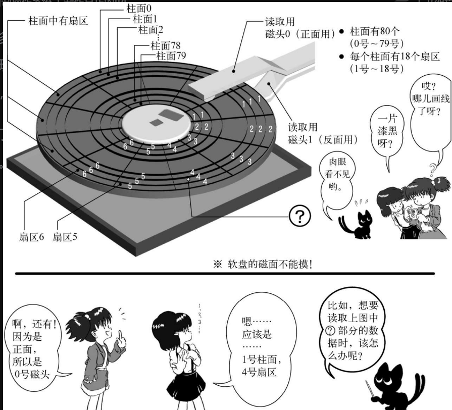
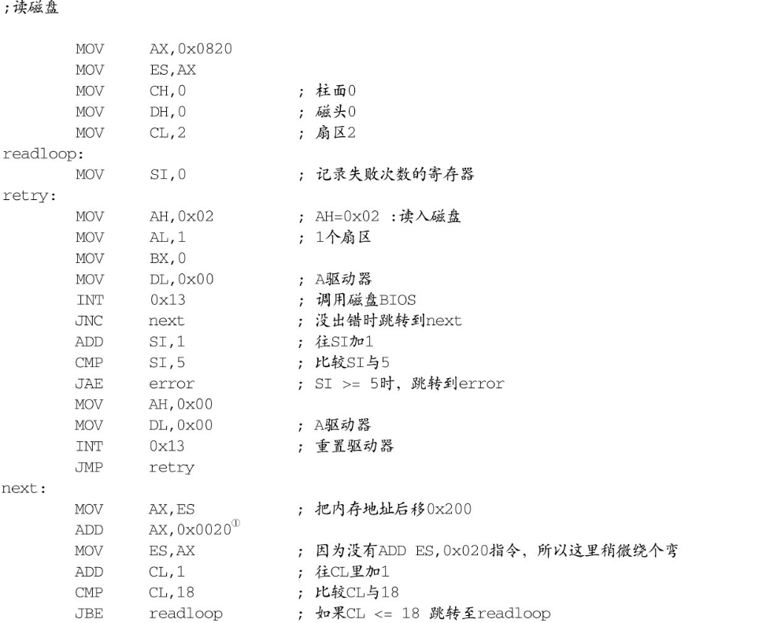
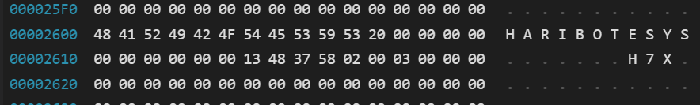
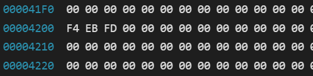
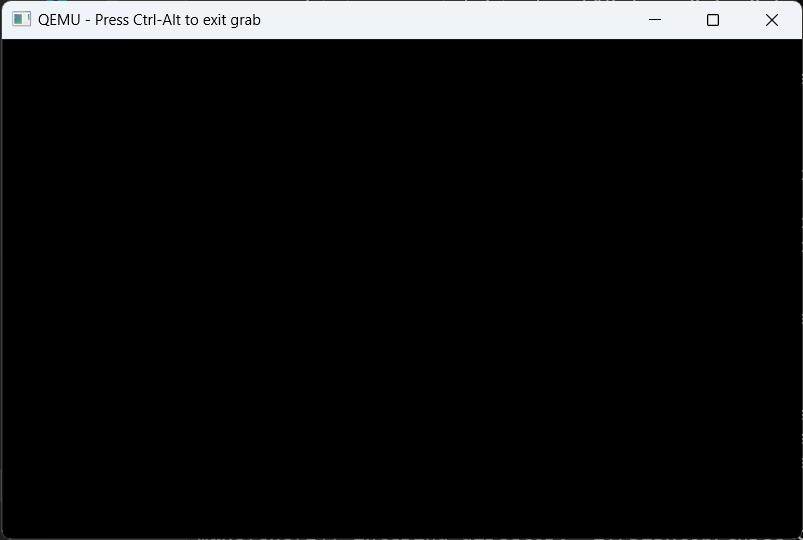
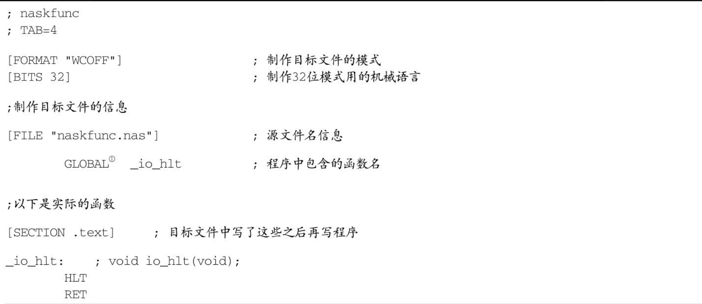
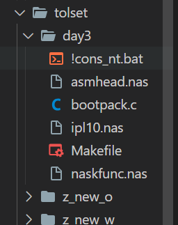

# 进入32位mod并导入c语言

## 3.1 制作真正的IPL

IPL（Initial Program Loader，启动程序装载器

```asm
MOV      AX,0x0820
MOV      ES, AX
MOV      CH,0              ; 柱面0
MOV      DH,0              ; 磁头0
MOV      CL,2              ; 扇区2

MOV      AH,0x02          ; AH=0x02 : 读盘
MOV      AL,1              ; 1个扇区
MOV      BX,0
MOV      DL,0x00          ; A驱动器
INT      0x13              ; 调用磁盘BIOS
JC       error
```

INT 0x13中断

❏ 磁盘读、写，扇区校验（verify），以及寻道（seek）

AH=0x02;（读盘）AH=0x03;（写盘）AH=0x04;（校验）AH=0x0c;（寻道）

AL=处理对象的扇区数；（只能同时处理连续的扇区）

CH=柱面号 &0xff；CL=扇区号（0-5位）|（柱面号&0x300）>>2；

DH=磁头号；DL=驱动器号；

ES:BX=缓冲地址；(校验及寻道时不使用)

返回值：FLACS.CF==0：没有错误，AH==0FLAGS.CF==1：有错误，错误号码存入AH内（与重置（reset）功能一样）


在有多个软盘驱动器的时候，用磁盘驱动器号来指定从哪个驱动器的软盘上读取数据。现在的电脑，基本都只有1个软盘驱动器，而以前一般都是2个。既然现在只有一个，那不用多想，指定0号就行了。


这次，我们指定了ES=0x0820, BX=0，所以软盘的数据将被装载到内存中0x8200到0x83ff的地方。

可能有人会想，怎么也不弄个整点的数，比如0x8000什么的，那多好。但0x8000～0x81ff这512字节是留给启动区的，要将启动区的内容读到那里，所以就这样吧。





1张软盘有80个柱面，2个磁头，18个扇区，且一个扇区有512字节。

所以，一张软盘的容量是：80×2×18×512=1474 560 Byte=1440KB

**含有IPL的启动区，位于C0-H0-S1（柱面0，磁头0，扇区1的缩写），**

**下一个扇区是C0-H0-S2。这次我们想要装载的就是这个扇区。**


**一般如果省略的话就会把“DS:”作为默认的段寄存器。**


## 3.2试错

软盘这东西很不可靠，有时会发生不能读数据的状况，这时候重新再读一次就行了。所以即使出那么一、两次错，也不要轻易放弃，应该让它再试几次。当然如果让它一直重试下去的话，要是磁盘真的坏了，程序就会陷入死循环，**所以我们决定重试5次**，再不行的话就真正放弃

```asm
;读磁盘

        MOV      AX,0x0820
        MOV      ES, AX
        MOV      CH,0              ; 柱面0
        MOV DH,0 ; 磁头0
        MOV CL,2 ; 扇区2

        MOV SI,0 ; 记录失败次数的寄存器
retry:
        MOV      AH,0x02          ; AH=0x02 : 读入磁盘
        MOV      AL,1              ; 1个扇区
        MOV      BX,0
        MOV      DL,0x00          ; A驱动器
        INT      0x13              ; 调用磁盘BIOS
        JNC      fin               ; 没出错的话跳转到fin
        ADD      SI,1              ; 往SI加1
        CMP      SI,5              ; 比较SI与5
        JAE      error             ; SI >= 5时，跳转到error
        MOV      AH,0x00
        MOV      DL,0x00          ; A驱动器
        INT      0x13              ; 重置驱动器
        JMP      retry
```

AH=0x00,DL=0x00, INT 0x13。这是“系统复位”。它的功能是复位软盘状态


## 3.3 读到18扇区



程序做的事情很简单，只要读一读程序大家马上会明白。要读下一个扇区，只需给CL加1，给ES加上0x20就行了。CL是扇区号，ES指定读入地址。0x20是十六进制下512除以16的结果，如果写成“ADD AX,512/16”或许更好懂。


**我们已经把磁盘上C0-H0-S2到C0-H0-S18的512×17=8704字节的内容，装载到了内存的0x8200～0xa3ff处。**

## 3.4 读入10个柱面

```asm
;读磁盘

        MOV      AX,0x0820
        MOV      ES, AX
        MOV      CH,0              ; 柱面0
        MOV      DH,0              ; 磁头0
        MOV      CL,2              ; 扇区2
readloop:
        MOV      SI,0              ; 记录失败次数的寄存器
retry:
        MOV      AH,0x02          ; AH=0x02 : 读入磁盘
        MOV      AL,1              ; 1个扇区
        MOV      BX,0
        MOV      DL,0x00          ; A驱动器
        INT      0x13              ; 调用磁盘BIOS
        JNC      next              ; 没出错时跳转到next
        ADD      SI,1              ; SI加1
        CMP      SI,5              ; 比较SI与5
        JAE      error             ; SI >= 5时，跳转到error
        MOV      AH,0x00
        MOV      DL,0x00          ; A驱动器
        INT      0x13              ; 重置驱动器
        JMP      retry

next:
        MOV      AX, ES             ; 把内存地址后移0x200
        ADD      AX,0x0020
        MOV      ES, AX             ; 因为没有ADD ES,0x020指令，所以这里稍微绕个弯
        ADD      CL,1              ; CL加1
        CMP      CL,18             ; 比较CL与18
        JBE      readloop         ; 如果CL <= 18，则跳转至readloop
        MOV      CL,1
        ADD      DH,1
        CMP      DH,2
        JB       readloop         ; 如果DH < 2，则跳转到readloop
        MOV      DH,0
        ADD      CH,1
        CMP      CH, CYLS
        JB       readloop         ; 如果CH < CYLS，则跳转到readloop
```

这个程序已经用从软盘读取的数据填满了内存0x08200～0x34fff的地方。


## 3.5着手开发os

先来编写一个非常短小的程序，就只让它HLT。

```asm
fin:
    HLT
    JMP fin
```

将以上内容保存为haribote.nas，用nask编译，输出成haribote.sys

将这个文件保存到磁盘映像里

❏ 使用make install指令，将磁盘映像文件写入磁盘。

❏ 在Windows里打开那个磁盘，把haribote.sys保存到磁盘上。

❏ 使用工具将磁盘备份为磁盘映像


以上内容可以总结为：一般向一个空软盘保存文件时，

(1) 文件名会写在0x002600以后的地方；



(2) 文件的内容会写在0x004200以后的地方。



了解了这一点，下面要做的事就简单了。

我们将操作系统本身的内容写到名为haribote.sys文件中，再把它保存到磁盘映像里，然后我们从启动区执行这个haribote.sys就行了

## 3.6 从启动区执行os

要怎样才能执行磁盘映像上位于0x004200号地址的程序呢？

现在的程序是从启动区开始，把磁盘上的内容装载到内存0x8000号地址，所以磁盘0x4200处的内容就应该位于内存0x8000+0x4200=0xc200号地址。

这样的话，我们就往haribote.nas里加上ORG 0xc200，然后在ipl.nas处理的最后加上JMP 0xc200这个指令


haribote.nas

```asm
; haribote-os
; TAB=4

        ORG      0xc200           ; 这个程序将要被装载到内存的什么地方呢？

        MOV      AL,0x13          ; VGA显卡，320x200x8位彩色
        MOV      AH,0x00
        INT      0x10
fin:
        HLT
        JMP      fin
```


此时的makefile

```makefile
# 默认动作

default :
	../z_tools/make.exe img

# 镜像文件生成

ipl.bin : ipl.nas Makefile
	../z_tools/nask.exe ipl.nas ipl.bin ipl.lst


haribote.bin: haribote.nas Makefile
	../z_tools/nask.exe haribote.nas haribote.bin haribote.lst

haribote.sys: haribote.bin Makefile
	cmd.exe /C copy /B haribote.bin haribote.sys


helloos.img : ipl.bin  haribote.sys  Makefile
	../z_tools/edimg.exe   imgin:../z_tools/fdimg0at.tek \
		wbinimg src:ipl.bin len:512 from:0 to:0 \
		copy from:haribote.sys to:@: \
		imgout:helloos.img

# 其他指令

asm :
	../z_tools/make.exe -r ipl.bin

img :
	../z_tools/make.exe -r helloos.img

run :
	../z_tools/make.exe img
	cmd.exe /C copy helloos.img ..\z_tools\qemu\fdimage0.bin
	../z_tools/make.exe -C ../z_tools/qemu

install :
	../z_tools/make.exe img
	../z_tools/imgtol.com w a: helloos.img

clean :
	cmd.exe /C del ipl.bin
	cmd.exe /C del ipl.lst
	cmd.exe /C del helloos.img
```

ipl.nas

```nas
; hello-os
; TAB=4
        CYLS	EQU		10	; 声明CYLS=10
        ORG      0x7c00           ; 指明程序的装载地址

        jmp   entry
; 以下这段是标准FAT12格式软盘专用的代码
        ;DB    0xeb, 0x4e
        DB    0x90
        DB    "HELLOIPL"      ; 启动区的名称可以是任意的字符串（8字节）
        DW    512              ; 每个扇区（sector）的大小（必须为512字节）
        DB    1                ; 簇（cluster）的大小（必须为1个扇区）
        DW    1          ; FAT的起始位置（一般从第一个扇区开始）
        DB    2          ; FAT的个数（必须为2）
        DW    224       ; 根目录的大小（一般设成224项）
        DW    2880      ; 该磁盘的大小（必须是2880扇区）
        DB    0xf0      ; 磁盘的种类（必须是0xf0）
        DW    9          ; FAT的长度（必须是9扇区）
        DW    18         ; 1个磁道（track）有几个扇区（必须是18）
        DW    2          ; 磁头数（必须是2）
        DD    0          ; 不使用分区，必须是0
        DD    2880      ; 重写一次磁盘大小
        DB    0,0,0x29        ; 意义不明，固定
        DD    0xffffffff      ;（可能是）卷标号码
        DB    "HELLO-OS   "   ; 磁盘的名称（11字节）
        DB    "FAT12   "      ; 磁盘格式名称（8字节）
        RESB  18               ; 先空出18字节

; 程序核心


entry:
        MOV      AX,0              ; 初始化寄存器
        MOV      SS, AX
        MOV      SP,0x7c00
        MOV      DS, AX
;读磁盘
        MOV      AX,0x0820
        MOV      ES, AX
        MOV      CH,0              ; 柱面0
        MOV      DH,0              ; 磁头0
        MOV      CL,2              ; 扇区2
readloop:
        MOV      SI,0              ; 记录失败次数的寄存器
retry:
        MOV      AH,0x02          ; AH=0x02 : 读入磁盘
        MOV      AL,1              ; 1个扇区
        MOV      BX,0
        MOV      DL,0x00          ; A驱动器
        INT      0x13              ; 调用磁盘BIOS
        JNC      next              ; 没出错时跳转到next
        ADD      SI,1              ; SI加1
        CMP      SI,5              ; 比较SI与5
        JAE      error             ; SI >= 5时，跳转到error
        MOV      AH,0x00
        MOV      DL,0x00          ; A驱动器
        INT      0x13              ; 重置驱动器
        JMP      retry

next:
        MOV      AX, ES             ; 把内存地址后移0x200
        ADD      AX,0x0020
        MOV      ES, AX             ; 因为没有ADD ES,0x020指令，所以这里稍微绕个弯
        ADD      CL,1              ; CL加1
        CMP      CL,18             ; 比较CL与18
        JBE      readloop         ; 如果CL <= 18，则跳转至readloop
        MOV      CL,1
        ADD      DH,1
        CMP      DH,2
        JB       readloop         ; 如果DH < 2，则跳转到readloop
        MOV      DH,0
        ADD      CH,1
        CMP      CH, CYLS
        JB       readloop         ; 如果CH < CYLS，则跳转到readloop

; 读取完毕，跳转到haribote.sys执行！
		MOV		[0x0ff0],CH		; 
		JMP		0xc200

error:
		MOV		SI,msg

putloop:
		MOV		AL,[SI]
		ADD		SI,1			; 给SI加1
		CMP		AL,0
		JE		fin
		MOV		AH,0x0e			; 显示一个文字
		MOV		BX,15			; 指定字符颜色
		INT		0x10			; 调用显卡BIOS
		JMP		putloop

fin:
		HLT						; 让CPU停止，等待指令
		JMP		fin				; 无限循环

msg:
		DB		0x0a, 0x0a		; 换行两次
		DB		"load error"
		DB		0x0a			; 换行
		DB		0

		RESB	0x7dfe-$		; 填写0x00直到0x001fe   因为从0x7c00开始的

		DB		0x55, 0xaa
```

make run的结果



## 3.8进入32位mod

现在，汇编语言的开发告一段落，我们要开始以C语言为主进行开发了，这是我们当前的目标。

**笔者准备的C编译器，只能生成32位模式的机器语言**

所谓32位模式，指的是CPU的模式。

CPU有16位和32位两种模式。如果以16位模式启动的话，用AX和CX等16位寄存器会非常方便，但反过来，像EAX和ECX等32位的寄存器，使用起来就很麻烦。

另外，16位模式和32位模式中，机器语言的命令代码不一样。同样的机器语言，解释的方法也不一样，所以**16位模式的机器语言在32位模式下不能运行，反之亦然。**32位模式下可以使用的内存容量远远大于1MB。

另外，**CPU的自我保护功能（识别出可疑的机器语言并进行屏蔽，以免破坏系统）在16位下不能用，但32位下能用**。既然有这么多优点，当然要使用32位模式了。

可是，如果用32位模式就不能调用BIOS功能了。这是因为**BIOS是用16位机器语言写的。如果我们有什么事情想用BIOS来做，那就全部都放在开头先做，因为一旦进入32位模式就不能调用BIOS函数了**。（当然，也有从32位返回到16位的方法，但是非常费工夫，所以本书不予赘述。）

```nas
; haribote-os
; TAB=4

; 有关BOOT_INFO
CYLS     EQU      0x0ff0           ; 设定启动区
LEDS     EQU      0x0ff1
VMODE   EQU      0x0ff2           ; 关于颜色数目的信息。颜色的位数。
SCRNX   EQU      0x0ff4           ; 分辨率的X（screen x）
SCRNY   EQU      0x0ff6           ; 分辨率的Y（screen y）
VRAM     EQU      0x0ff8           ; 图像缓冲区的开始地址

        ORG      0xc200           ; 这个程序将要被装载到内存的什么地方呢？
        MOV      AL,0x13          ; VGA显卡，320x200x8位彩色
        MOV      AH,0x00
        INT      0x10
        MOV      BYTE [VMODE],8  ; 记录画面模式
        MOV      WORD [SCRNX],320
        MOV      WORD [SCRNY],200
        MOV      DWORD [VRAM],0x000a0000

;用BIOS取得键盘上各种LED指示灯的状态
        MOV      AH,0x02
        INT      0x16              ; keyboard BIOS
        MOV      [LEDS], AL

fin:
        HLT
        JMP      fin
```

看一下程序就能明白，设置画面模式之后，还把画面模式的信息保存在了内存里。这是因为，以后我们可能要支持各种不同的画面模式，这就需要把现在的设置信息保存起来以备后用。我们暂且将启动时的信息称为BOOT_INFO


[VRAM]里保存的是0xa0000。

在电脑的世界里，**VRAM指的是显卡内存（video RAM）**，也就是用来显示画面的内存。这一块内存当然可以像一般的内存一样存储数据，但VRAM的功能不仅限于此，**它的各个地址都对应着画面上的像素，可以利用这一机制在画面上绘制出五彩缤纷的图案**

其实VRAM分布在内存分布图上好几个不同的地方。这是因为，不同画面模式的像素数也不一样。当画面模式为〇×时使用这个VRAM；而画面模式为◇△时可能使用那个VRAM，像这样，不同画面模式可以使用的内存也不一样


这次VRAM的值是0xa0000。这个值又是从哪儿得来的呢？还是来看看我们每次都参考的（AT）BIOS支持网页。在INT 0x10的说明的最后写着，这种画面模式下“VRAM是0xa0000～0xaffff的64KB”。


## 3.9 导入c语言

现在我们直接切换到32位模式，然后运行用C语言写的程序

**首先是haribote.sys，它的前半部分是用汇编语言编写的，而后半部分则是用C语言编写的。**

所以以前的文件名haribote.nas也随之改成了asmhead.nas。

并且，为了调用C语言写的程序，添加了100行左右的汇编代码。


```c
//bootpack.c
void HariMain(void)
{

fin:
    /＊这里想写上HLT，但C语言中不能用HLT! ＊/
    goto fin;

}
```


goto指令是新出现的，相当于汇编语言中的JMP，实际上也是被编译成JMP指令。

**这个bootpack.c是怎样变成机器语言的呢？**

如果不能变成机器语言，就是说得再多也没有意义

这个步骤很长，让我们看一看。

❏ 首先，使用cc1.exe从**bootpack.c**生成bootpack.gas。

❏ 第二步，使用gas2nask.exe从bootpack.gas生成**bootpack.nas**。

❏ 第三步，使用nask.exe从bootpack.nas生成**bootpack.obj**。

❏ 第四步，使用obi2bim.exe从bootpack.obj生成**bootpack.bim**。

❏ 最后，使用bim2hrb.exe从bootpack.bim生成**bootpack.hrb**。

❏ 这样就做成了机器语言，**再使用copy指令将asmhead.bin与bootpack.hrb单纯结合到起来**，就成了haribote.sys。


<font color='red'>cc1是C编译器，可以将C语言程序编译成汇编语言源程序。</font>

<font color='red'>但这个C编译器是笔者从名为gcc的编译器改造而来，而**gcc又是以gas汇编语言为基础，输出的是gas用的源程序。它不能翻译成nask**</font>

<font color='red'>我们需要把gas变换成nask能翻译的语法，这就是gas2nas</font>


一旦转换成nas文件，它可就是我们的掌中之物了，只要用nask翻译一下，就能变成机器语言了。实际上也正是那样，首先用nask制作obj文件。obj文件又称目标文件，源自英文的“object”，也就是目标的意思。程序是用C语言写的，而我们的目标是机器语言，所以这就是“目标文件”这一名称的由来


可能会有人想，既然已经做成了机器语言，那只要把它写进映像文件里就万事大吉了。但很遗憾，这还不行，事实上这也正是使用C语言的不便之处。**目标文件是一种特殊的机器语言文件，必须与其他文件链接（link）后才能变成真正可以执行的机器语言。**链接是什么意思呢？实际上C语言的作者已经认识到，**C语言有它的局限性，不可能只用C语言来编写所有的程序，所以其中有一部分必须用汇编来写，然后链接到C语言写的程序上。**


所以，**为了将目标文件与别的目标文件相链接，除了机器语言之外，其中还有一部分是用来交换信息的。单个的目标文件还不是独立的机器语言，其中还有一部分是没完成的。为了能做成完整的机器语言文件，必须将必要的目标文件全部链接上。**完成这项工作的，就是obj2bim。bim是笔者设计的一种文件格式，意思是“binary image”，它是一个二进制映像文件


所以，实际上bim文件也“不是本来的状态，而是一种代替的形式”，也还不是完成品。这只是将各个部分全部都链接在一起，做成了一个完整的机器语言文件，而**为了能实际使用，我们还需要针对每一个不同操作系统的要求进行必要的加工，比如说加上识别用的文件头，或者压缩等**。这次因为要做成适合“纸娃娃操作系统”要求的形式，所以笔者为此专门写了一个程序bim2hrb.exe，这个程序留到后面来介绍。


啊，忘了一件大事。函数名HariMain非常重要，程序就是从以HariMain命名的函数开始运行的，所以这个函数名不能更改。执行这个函数，结果出现黑屏。这表示运行正常。

## 3.10实现hlt



也就是说，是用汇编语言写了一个函数。函数名叫io_hlt。

虽然只叫hlt也行，但在CPU的指令之中，HLT指令也属于I/O指令，所以就起了这么一个名字。

用汇编写的函数，之后还要与bootpack.obj链接，所以也需要编译成目标文件。因此将输出格式设定为WCOFF模式。另外，还要设定成32位机器语言模式。

**在nask目标文件的模式下，必须设定文件名信息，然后再写明下面程序的函数名。**

**注意要在函数名的前面加上“_”，否则就不能很好地与C语言函数链接。需要链接的函数名，都要用GLOBAL指令声明。**


```c
//bootpack.c
/＊告诉C编译器，有一个函数在别的文件里＊/

void io_hlt(void);

/＊是函数声明却不用{ }，而用；，这表示的意思是：函数是在别的文件中，你自己找一下吧！＊/

void HariMain(void)
{

fin:
    io_hlt(); /＊执行naskfunc.nas里的_io_hlt＊/
    goto fin;

}
```


CMD 

/C      Carries out the command specified by string and then terminates




asmhead.nas

```asmhead.nas
; haribote-os boot asm
; TAB=4

BOTPAK	EQU		0x00280000		; 加载bootpack
DSKCAC	EQU		0x00100000		; 磁盘缓存的位置
DSKCAC0	EQU		0x00008000		; 磁盘缓存的位置（实模式）

; BOOT_INFO相关
CYLS	EQU		0x0ff0			; 引导扇区设置
LEDS	EQU		0x0ff1
VMODE	EQU		0x0ff2			; 关于颜色的信息
SCRNX	EQU		0x0ff4			; 分辨率X
SCRNY	EQU		0x0ff6			; 分辨率Y
VRAM	EQU		0x0ff8			; 图像缓冲区的起始地址

		ORG		0xc200			;  这个的程序要被装载的内存地址


		MOV		AL,0x13			; VGA显卡，320x200x8bit
		MOV		AH,0x00
		INT		0x10
		MOV		BYTE [VMODE],8	; 屏幕的模式（参考C语言的引用）
		MOV		WORD [SCRNX],320
		MOV		WORD [SCRNY],200
		MOV		DWORD [VRAM],0x000a0000

; 通过BIOS获取指示灯状态

		MOV		AH,0x02
		INT		0x16 			; keyboard BIOS
		MOV		[LEDS],AL

; 防止PIC接受所有中断
;	AT兼容机的规范、PIC初始化
;	然后之前在CLI不做任何事就挂起
;	PIC在同意后初始化

		MOV		AL,0xff
		OUT		0x21,AL
		NOP						; 不断执行OUT指令
		OUT		0xa1,AL

		CLI						; 进一步中断CPU

; 让CPU支持1M以上内存、设置A20GATE

		CALL	waitkbdout
		MOV		AL,0xd1
		OUT		0x64,AL
		CALL	waitkbdout
		MOV		AL,0xdf			; enable A20
		OUT		0x60,AL
		CALL	waitkbdout

; 保护模式转换

[INSTRSET "i486p"]				; 说明使用486指令

		LGDT	[GDTR0]			; 设置临时GDT
		MOV		EAX,CR0
		AND		EAX,0x7fffffff	; 使用bit31（禁用分页）
		OR		EAX,0x00000001	; bit0到1转换（保护模式过渡）
		MOV		CR0,EAX
		JMP		pipelineflush
pipelineflush:
		MOV		AX,1*8			;  写32bit的段
		MOV		DS,AX
		MOV		ES,AX
		MOV		FS,AX
		MOV		GS,AX
		MOV		SS,AX

; bootpack传递

		MOV		ESI,bootpack	; 源
		MOV		EDI,BOTPAK		; 目标
		MOV		ECX,512*1024/4
		CALL	memcpy

; 传输磁盘数据

; 从引导区开始

		MOV		ESI,0x7c00		; 源
		MOV		EDI,DSKCAC		; 目标
		MOV		ECX,512/4
		CALL	memcpy

; 剩余的全部

		MOV		ESI,DSKCAC0+512	; 源
		MOV		EDI,DSKCAC+512	; 目标
		MOV		ECX,0
		MOV		CL,BYTE [CYLS]
		IMUL	ECX,512*18*2/4	; 除以4得到字节数
		SUB		ECX,512/4		; IPL偏移量
		CALL	memcpy

; 由于还需要asmhead才能完成
; 完成其余的bootpack任务

; bootpack启动

		MOV		EBX,BOTPAK
		MOV		ECX,[EBX+16]
		ADD		ECX,3			; ECX += 3;
		SHR		ECX,2			; ECX /= 4;
		JZ		skip			; 传输完成
		MOV		ESI,[EBX+20]	; 源
		ADD		ESI,EBX
		MOV		EDI,[EBX+12]	; 目标
		CALL	memcpy
skip:
		MOV		ESP,[EBX+12]	; 堆栈的初始化
		JMP		DWORD 2*8:0x0000001b

waitkbdout:
		IN		 AL,0x64
		AND		 AL,0x02
		JNZ		waitkbdout		; AND结果不为0跳转到waitkbdout
		RET

memcpy:
		MOV		EAX,[ESI]
		ADD		ESI,4
		MOV		[EDI],EAX
		ADD		EDI,4
		SUB		ECX,1
		JNZ		memcpy			; 运算结果不为0跳转到memcpy
		RET
; memcpy地址前缀大小

		ALIGNB	16
GDT0:
		RESB	8				; 初始值
		DW		0xffff,0x0000,0x9200,0x00cf	; 写32bit位段寄存器
		DW		0xffff,0x0000,0x9a28,0x0047	; 可执行的文件的32bit寄存器（bootpack用）

		DW		0
GDTR0:
		DW		8*3-1
		DD		GDT0

		ALIGNB	16
bootpack:

```

bootpack.c

```c
/* 告诉C编译器，有一个函数在别的文件里 */

void io_hlt(void);

/* 是函数声明却不用{}，而用;，这表示的意思是：
	函数在别的文件中，你自己找一下 */

void HariMain(void)
{

fin:
	io_hlt(); /* 执行naskfunc.nas中的_io_hlt函数 */
	goto fin;

}

```

naskfunc.nas

```asm
; naskfunc
; TAB=4

[FORMAT "WCOFF"]				; 制作目标文件的模式	
[BITS 32]						; 制作32位模式用的机器语言


; 制作目标文件的信息

[FILE "naskfunc.nas"]			; 源文件名信息

		GLOBAL	_io_hlt			; 程序中包含的函数名


; 以下是实际的函数

[SECTION .text]		; 目标文件中写了这些后再写程序

_io_hlt:	; void io_hlt(void);
		HLT
		RET

```

makefile的make clean无法成功

make run正常运行