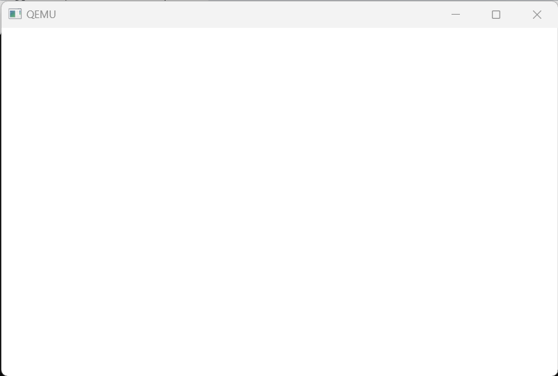
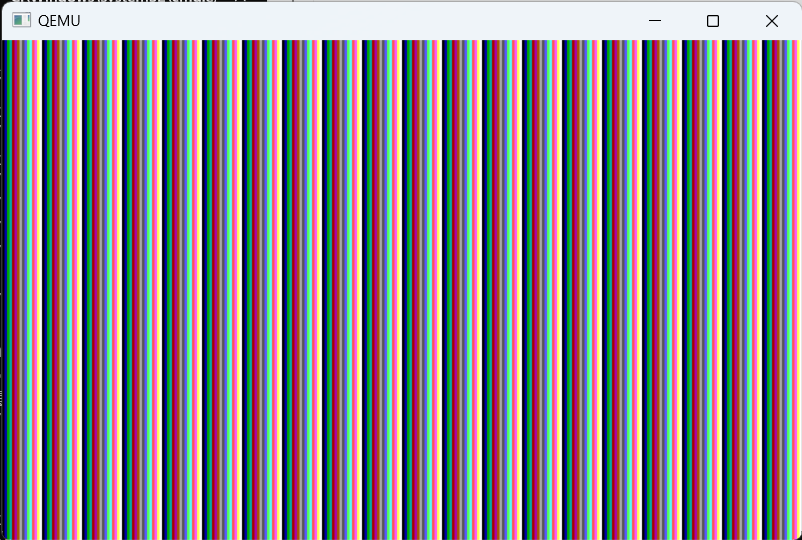
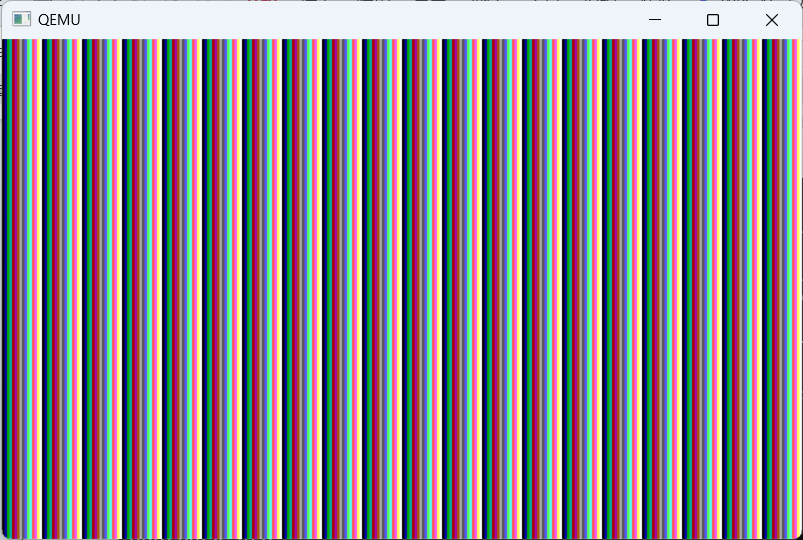
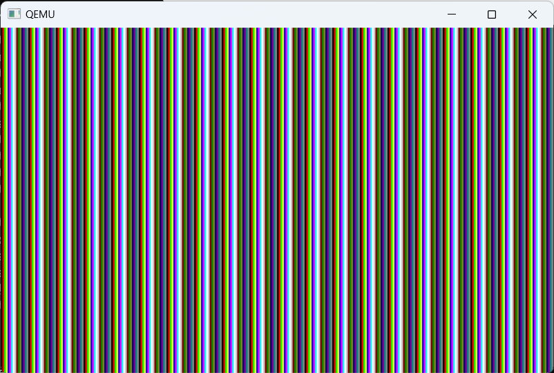
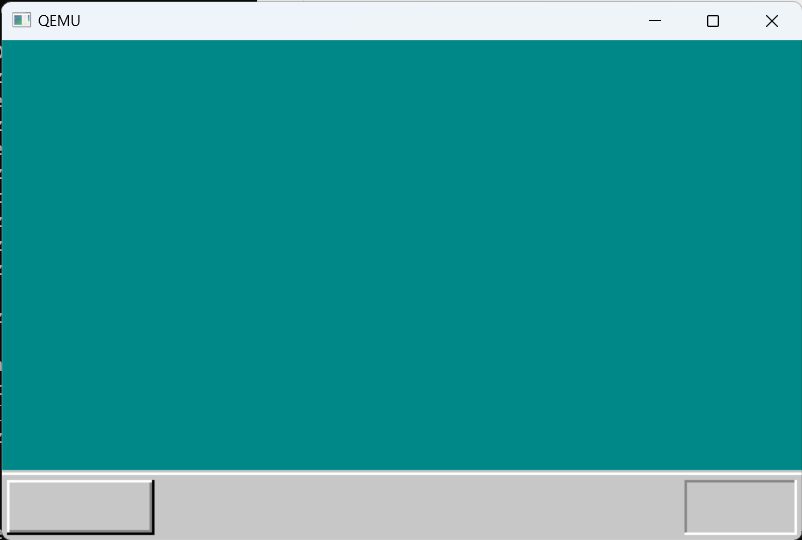

# c语言与画面显示的练习

## 4.1 用c语言实现内存写入

昨天我们成功实现 画面显示黑屏

**想要画点什么，只需向VRAM里写入内容即可**

**c语言没有直接写指定内存地址的语句**，我们自己创建

```asm
; naskfunc
; TAB=4

[FORMAT "WCOFF"]				; 制作目标文件的模式	
[INSTRSET "i486p"]				; 使用到486为止的指令
[BITS 32]						; 制作32位模式用的机器语言


; 制作目标文件的信息

[FILE "naskfunc.nas"]			; 源文件名信息

		GLOBAL	_io_hlt			; 程序中包含的函数名
		GLOBAL	_write_mem8		


; 以下是实际的函数

[SECTION .text]		; 目标文件中写了这些后再写程序

_io_hlt:	; void io_hlt(void);
		HLT
		RET

_write_mem8: ;void write_mem8(int addr, int data);
		mov ecx,[esp+4] ;存放地址
		mov al,[esp+8] ;存放数据
		mov [ecx],al
		RET

```


给naskfunc增加一个write_mem8的函数

这个函数类似于C语言中的“write_mem8(0x1234,0x56);”语句，动作上相当于“MOV BYTE[0x1234],0x56”。

在C语言中如果用到了write_mem8函数，就会跳转到_write_mem8。此时参数指定的数字就存放在内存里，分别是：

第一个数字的存放地址：[ESP + 4]

第二个数字的存放地址：[ESP+ 8]

第三个数字的存放地址：[ESP+ 12]

我们想取得用参数指定的数字0x1234或0x56的内容，就用MOV指令读入寄存器。

**因为CPU已经是32位模式，所以我们积极使用32位寄存器。**

这次还给naskfunc.nas增加了一行，那就是INSTRSET指令。它是用来告诉nask“这个程序是给486用的哦”,nask见了这一行之后就知道“哦，那见了EAX这个词，就解释成寄存器名”。如果什么都不指定，**它就会认为那是为8086这种非常古老的、而且只有16位寄存器的CPU而写的程序，见了EAX这个词，会误解成标签(Label),或是常数。**8086那时候写的程序中，曾偶尔使用EAX来做标签，当时也没想到这个单词后来会成为寄存器名而不能再随便使用。

**我们来简单介绍一下电脑的CPU(英特尔系列)家谱。**

**8086→80186→286→386→486→Pentium→PentiumPro→PentiumlI→PentiumlI→Pentium4→…**

从上面的家谱来看，386已经是非常古老的CPU了。到286为止CPU是16位，而386以后CPU是32位

```c
//bootpack.c
/* 告诉C编译器，有一个函数在别的文件里 */

void io_hlt(void);
void write_mem8(int addr,int data);
/* 是函数声明却不用{}，而用;，这表示的意思是：
	函数在别的文件中，你自己找一下 */

void HariMain(void){

	int i;
	for(i=0xa0000;i<0xaffff;i++){
		write_mem8(i,15);
	}
	for(;;){
		io_hlt();
	}

}
```




画面是白屏。

哦?这是怎么回事呢?

**因为VRAM全部都写入了15,意思是全部像素的颜色都是第15种颜色，而第15种颜色碰巧是纯白，所以画面就成了白色。**

## 4.2 条纹图案

```c
for(i= 0xa0000;i <= Oxaffff; i++){
	write_mem8(i,i& 0x0f);
}
```

但写入的值由15变成了i&0x0f。(从0x0到0xf)

就像这样，每隔16个像素，色号就反复一次



## 4.3挑战指针

前面说过“C语言中没有直接写入指定内存地址的语句”,实际上这不是C语言的缺陷，因

为有替代这种命令的语句。一般大多数程序员主要使用那种替代语句，像这次这样，做一个函数write_mem8的，也就只有笔者了。如果有替代方案的话，大家肯定想用一下，笔者也想试试看。

write_mem3(i,1 & 0x0E);


替代以上语句的是：

*i = i & OxOf;

invalid type argument of unary *  类型错误

**这种写法，从本质上讲没问题，但这样就是无法顺利运行。我们从编译器的角度稍微想想就能明白为什么会出错了。回想一下，如果写以下汇编语句，会发生什么情况呢?**

**MOV [ 0x1234],0x56**

**是的，会出错。这是因为指定内存时，不知道到底是BYTE,还是WORD,还是DWORD。只有在另一方也是寄存器的时候才能省略，其他情况都不能省略。其实C编译器也面临着同样的问题。这次，我们费劲写了一条C语句，它的编译结果相当于下面的汇编语句所生成的机器语言，**

**Mov [i],(i& 0x0f)**

**但却不知道[i]到底是BYTE,还是WORD,还是DWORD。刚才就是出现了这种错误**


**那怎么才能告诉计算机这是BYTE呢?**

**char *p;/*,变量p是用于内存地址的专用变量*/**

声明一个上面这样变量p,p里放入与i相同的值，然后执行以下语句。

*p = i & 0x0f;

这样，C编译器就会认为“P是地址专用变量，而且是用于存放字符(char)的，所以就是BYTE.”。顺便解释一下类似语句：

**char *p;/*用于BYTE类地址*/**

**short *p;/*用于WORD类地址*/**

**int *p;/*用于DWORD类地址*/**

这次我们是一个字节一个字节地写入，所以使用了char。

既然说到这里，那我们再介绍点相关知识，“chari;”是类似AL的1字节量，“short i;”是类似AX的2字节变量，“int i;”是类似EAX的4字节变量。而不管是“char*p”,还是“short*p”,还是“int*p”,变量p都是4字节。这是因为p是用于记录地址的变量。在汇编语言中，地址也像ECX一样，用4字节的寄存器来指定，所以也是4字节

```c
//bootpack.c
/* 告诉C编译器，有一个函数在别的文件里 */

void io_hlt(void);
// void write_mem8(int addr,int data);
/* 是函数声明却不用{}，而用;，这表示的意思是：
	函数在别的文件中，你自己找一下 */

void HariMain(void)
{
	int i;/*变量声明。变量i是32位整数*/
	char *p;/*变量p,用于BYTE型地址*/
	for(i=0xa0000;i<= 0xaffff; i++){
		 p= i; /*代入地址*/
		*p =i& 0x0f;
		/*这可以替代write_mem8(i,iε 0x0f);*/
	}
	for(;;){
		io_hlt();
	}
}

```




嗯?且慢!仔细看看画面，发现有一行警告。

warning: assignment makes pointer from integer without a cast3 挑战指针(harib01c)……711这个警告的意思是说，“赋值语句没有经过类型转换，由整数生成了指针”。其中有两个单词的意思不太明白。类型转换是什么?指针又是什么?类型转换是改变数值类型的命令。一般不必每次都注意类型转换，但像这次的语句中，如果不明确进行类型转换，C编译器就会每次都发出警告：“喂，是不是写错了?”顺便说一下**cast在英文中的原意是压入模具，让材料成为某种特定的形状。**

指针是表示内存地址的数值。C语言中不用“内存地址”这个词，而是用“指针”。在C语

言中，普通数值和表示内存地址的数值被认为是两种不同的东西，虽然笔者也觉得它们没什么不同，但也只能接受这种设计思想了。基于这种设计思想，如果将普通整数值赋给内存地址变量，就会有警告。为了避免这种情况的发生，可以这样写：

**p=(char *) i;**


**这样的写法虽然有点绕圈子了，但我们实现了只用C语言写入内存的功能。**

好不容易介绍完了类型转换，我们来看一个应用实例吧。如果定义：

p=(char *)i;

那么将上式代入下面语句中。

*p =i & 0x0f;

这样就能得到下式：

*((char *)i)= i & 0x0f;

## 4.4指针应用

```c
p=(char *)0xa0000;/*给地址变量赋值*/
for(i=0;i<= 0xffff; i++){
	*(p+i)=i&0x0f;
}
```

```c
p =(char *)0xa0000;/*将地址赋值进去*/
for(i=0;i<= Oxffff; i++){
	p[i]=i&0x0f;
}	
```

写得不好的 C语言教科书里，往往会说p[i]是数组p的第i个元素。这虽然也不算错，

但终究有些敷衍,不是说改变一下写法，地址变量就变成数组了。大家不要被那些劣质的教科书骗了。编译器生成的机器语言也完全一样。这比什么都更能证明，意思没有变化，只是写法不同。

说个题外话，加法运算可以交换顺序，所以将*(p+i)写成*(i+p)也是可以的。同理，

将 p[i]写成 i[p]也是可以的(可能你会不相信，但这样写既不会出错，也能正常运行)。a[2]也可以写成 2[a] (这当然是真的)。难道还能说这是名为 2的数组的第 a个元素吗?当然不能。所以，p[i]也好，i[p]也好，仅仅是一种省略写法，本质上讲，与数组没有关系。

## 4.5色号设定

好了，到现在为止我们的话题都是以C语言为中心的，但我们的目的不是为了掌握C语言，而是为了制作操作系统，操作系统中是不需要条纹图案之类的。我们继续来做操作系统吧。

可能大家马上就想描绘一个操作系统模样的画面，但在此之前要先做一件事，那就是**处理颜色问题**。**这次使用的是320×200的8位颜色模式，色号使用8位(二进制)数**，也就是只能使用0～255的数。我想熟悉电脑颜色的人都会知道，这是非常少的。**一般说起指定颜色，都是用#ffffff一类的数。这就是RGB(红绿蓝)方式，用6位十六进制数，也就是24位(二进制)来指定颜色**。8位数完全不够。那么,该怎么指定#ffffff方式的颜色呢


这个8位彩色模式，是由程序员随意指定0～255的数字所对应的颜色的。比如说25号颜色对应#ffffff,26号颜色对应#123456等。这种方式就叫做调色板(palette)。

如果像现在这样，程序员不做任何设定，0号颜色就是#000000,15号颜色就是#ffffff。其他号码的颜色，笔者也不是很清楚，所以可以按照自己的喜好来设定并使用。

笔者通过制作OSAKA知道：要想描绘一个操作系统模样的画面，只要有以下这16种颜色就足够了。

**所以这次我们也使用这16种颜色，并给它们编上号码0-15。**

**\#000000:黑**

**\#ff0000:亮红**

**\#00ff00:亮绿**

**\#ffff00:亮黄**

**\#0000fE:亮蓝**

**\#FF00FE:亮紫**

**\#00fffE:浅亮蓝**

**\#ffffff:白**

**\#c6c6c6:亮灰**

**\#840000:暗红**

**\#008400:暗绿**

**\#848400:暗黄**

**\#000084:暗蓝**

**\#840084:暗紫**

**\#008484:浅暗蓝**

**\#848484:暗灰**

所以我们要给bootpack.c添加很多代码

```c
void io_hlt(void);
void io_cli(void);
void io_out8(int port, int data);
int io_load_eflags(void);
void io_store_eflags(int eflags);
/*就算写在同一个源文件里，如果想在定义前使用，还是必须事先声明一下。*/
void init_palette(void);
void set_palette(int start, int end, unsigned char *rgb);
void HariMain(void){
	int i;/* 声明变量。变量i是32位整数型 */
	char *p;/* 变量p是BYTE[..]用的地址 */
	init_palette();/*设定调色板 */
	p=(char *)0xa0000;/* 指定地址 */
	for(i=0;i<= 0xffff; i++){
		p[i] =i&0x0f;
	}
	for(;;){
		io_hlt();
	}
}
void init_palette(void)
{
	static unsigned char table_rgb[16 * 3] = {
		0x00,0x00,0x00,/* 0:黑*/
		0xff,0x00,0x00, /* 1:亮红 */
		0x00,0xff,0x00, /* 2:亮绿 */
		0xff,0xff,0x00, /* 3:亮黄*/
		0x00,0x00,0xff, /* 4:尧蓝*/
		0xff,0x00,0xff, /*5:亮紫 */
		0x00,0xff,0xff, /* 6:浅亮蓝*/
		0xff,0xff,0xff, /* 7:白*/
		0xc6,0xc6,0xc6, /*8:亮灰 */
		0x84,0x00,0x00, /*9:暗红 */
		0x00,0x84,0x00, /* 10:暗绿 */
		0x84,0x84,0x00, /* 11:暗黄*/
		0x00,0x00,0x84, /* 12:暗青 */
		0x84,0x00,0x84, /* 13:暗紫*/
		0x00,0x84,0x84, /* 14:浅暗蓝 */
		0x84,0x84,0x84 /* 15:暗灰 */
	};
	set_palette(0,15,table_rgb);
	return;
}

/* C语言中的static char语句只能用于数据，相当于汇编中的DB指令 */
void set_palette(int start, int end, unsigned char *rgb)
{
	int i,eflags;
	eflags = io_load_eflags();/* 记录中断许可标志的值*/
	io_cli(); /* 将中断许可标志置为0,禁止中断 */
	io_out8(0x03c8,start);
	for(i = start; i<= end; i++){
		io_out8(0x03c9,rgb[0] / 4);//设备号码
		io_out8(0x03c9,rgb[1] / 4);
		io_out8(0x03c9,rgb[2]/ 4);
		rgb += 3;
	}
	io_store_eflags(eflags); /*复原中断许可标志 */
	return;
}
```

char型的变量有3种模式，分别是signed型、unsigned型和未指定型。signed型用于处理-128~127的整数。它虽然也能处理负数，扩大了处理范围，很方便，但能够处理的最大值却减小了一半。unsigned型能够处理0～255的整数。**未指定型是指没有特别指定时，可由编译器决定是unsigned还是signed。**


这个程序所做的事情，仅仅是多次调用io_out8。函数io_out8是干什么的呢?以后在naskfunc.nas中还要详细说明，现在大家只要知道它是往指定装置里传送数据的函数就行了。

**我们前面已经说过，CPU的管脚与内存相连。如果仅仅是与内存相连，CPU就只能完成计算和存储的功能。但实际上，CPU还要对键盘的输入有响应，要通过网卡从网络取得信息，通过声卡发送音乐数据，向软盘写入信息等。这些都是设备(device),它们当然也都要连接到CPU上。**

**既然CPU与设备相连，那么就有向这些设备发送电信号，或者从这些设备取得信息的指令。向设备发送电信号的是OUT指令；从设备取得电气信号的是IN指令。正如为了区别不同的内存要使用内存地址一样，在OUT指令和IN指令中，为了区别不同的设备，也要使用设备号码。设备号码在英文中称为port(端口)。port原意为“港口”,这里形象地将CPU与各个设备交换电信号的行为比作了船舶的出港和进港。**

我想不用说大家也会感觉得到，**<font color='red'>在C语言中，没有与IN或OUT指令相当的语句，所以我们只好拿汇编语言来做了</font>**。唉，汇编真是关键时刻显身手的语言呀


如果我们读一读程序的话，就会发现突然蹦出了**0x03c8、0x03c9之类的设备号码**，这些设备号码到底是如何获得的呢?随意写几个数字行不行呢?这些号码当然不是能随便乱写的。


**口 调色板的访问步骤。**

口 首先在一连串的访问中屏蔽中断(比如CLI)。

口将想要设定的调色板号码写人0x03c8,紧接着，按R,G,B的顺序写入0x03c9。如果还想继续设定下一个调色板，则省略调色板号码，再按照RGB的顺序写入0x03c9就行了。

口如果想要读出当前调色板的状态，首先要将调色板的号码写入0x03c7,再从0x03c9读取3次。读出的顺序就是R,G,B。如果要继续读出下一个调色板，同样也是省略调色板号码的设定，按RGB的顺序读出。

口 如果最初执行了CLI,那么最后要执行STI。


所谓CLI,是将中断标志(interruptflag)置为0的指令(clear interruptflag)。STI是要将这个中断标志置为1的指令(set interrupt flag)


下面再来介绍一下EFLAGS这一特别的寄存器。这是由名为FLAGS的16位寄存器扩展而来的32位寄存器。FLAGS是存储进位标志和中断标志等标志的寄存器。进位标志可以通过JC或JNC等跳转指令来简单地判断到底是0还是1。**但对于中断标志，没有类似的Ⅱ或JNI命令，所以只能读入EFLAGS,再检查第9位是0还是1。**

```asm
; naskfunc
; TAB=4

[FORMAT "WCOFF"]				; 制作目标文件的模式	
[INSTRSET "i486p"]				; 使用到486为止的指令
[BITS 32]						; 制作32位模式用的机器语言

; 制作目标文件的信息

[FILE "naskfunc.nas"]			; 源文件名信息

		;GLOBAL	_io_hlt			; 程序中包含的函数名
		;GLOBAL	_write_mem8		
		GLOBAL _io_hlt,_io_cli,_io_sti, io_stihlt
		GLOBAL _io_in8,_io_in16, _io_in32
		GLOBAL _io_out8,_io_out16,_io_out32
		GLOBAL _io_load_eflags,_io_store_eflags	


; 以下是实际的函数

[SECTION .text]		; 目标文件中写了这些后再写程序

_io_hlt:	; void io_hlt(void);
		HLT
		RET

;_write_mem8: ;void write_mem8(int addr, int data);
;		mov ecx,[esp+4] ;存放地址
;		mov al,[esp+8] ;存放数据
;		mov [ecx],al
;		RET

_io_cli: 	; void io_cli(void);
		CLI
		RET

_io_sti:	; void io_sti(void);
		STI
		RET

-io_stihlt: ; void io_stihlt(void);
		STI
		HLT
		RET
_io_in8:	; int io_in8(int port);
		MOV		EDX,[ESP+4]		; port
		MOV		EAX,0
		IN		AL,DX
		RET

_io_in16:	; int io_in16(int port);
		MOV		EDX,[ESP+4]		; port
		MOV		EAX,0
		IN		AX,DX
		RET

_io_in32:	; int io_in32(int port);
		MOV		EDX,[ESP+4]		; port
		IN		EAX,DX
		RET

_io_out8:	; void io_out8(int port, int data);
		MOV		EDX,[ESP+4]		; port
		MOV		AL,[ESP+8]		; data
		OUT		DX,AL
		RET

_io_out16:	; void io_out16(int port, int data);
		MOV		EDX,[ESP+4]		; port
		MOV		EAX,[ESP+8]		; data
		OUT		DX,AX
		RET

_io_out32:	; void io_out32(int port, int data);
		MOV		EDX,[ESP+4]		; port
		MOV		EAX,[ESP+8]		; data
		OUT		DX,EAX
		RET

_io_load_eflags:	; int io_load_eflags(void);
		PUSHFD		; PUSH EFLAGS 
		POP		EAX
		RET

_io_store_eflags:	; void io_store_eflags(int eflags);
		MOV		EAX,[ESP+4]
		PUSH	EAX
		POPFD		; POP EFLAGS 
		RET

```


**如果有“MOV EAX,EFLAGS”之类的指令就简单了，但CPU没有这种指令。能够用来读写EFLAGS的，只有PUSHFD和POPFD指令。**


PUSHFD是“push flags double-word”的缩写，意思是将标志位的值按双字长压栈。

，“PUSHFD POP EAX”,是指首先将EFLAGS压人栈，再将弹出的值代入EAX。

所以说它代替了“MOVEAX,EFLAGS”。

另一方面，PUSHEAXPOPFD正与此相反，它相当于“MOV EFLAGS,EAX”。


最后要讲的是io_load_eflags。它对我们而言，是第一个有返回值的函数的例子，但**根据C语言的规约，执行RET语句时，EAX中的值就被看作是函数的返回值**



## 4.6绘制矩形

首先从VRAM与画面上的“点”的关系开始说起。在当前画面模式中，画面上有320×200(=64 000)个像素。假设左上点的坐标是(0,0),右下点的坐标是(319319),那么像素坐标(x,y)对应的VRAM地址应按下式计算。

0xa0000 +x+y* 320

根据上式计算像素的地址，往该地址的内存里存放某种颜色的号码，那么画面上该像素的位置就出现相应的颜色。这样就画出了一个点。继续增加x的值，循环以上操作，就能画一条长长的水平直线。再向下循环这条直线，就能够画很多的直线，组成一个有填充色的长方形。


根据这种思路，我们制作了函数boxfill8。

并且在程序HariMain中，我们不再画条纹图案，而是使用这个函数3次，画3个矩形。

```c
void io_hlt(void);
void io_cli(void);
void io_out8(int port, int data);
int io_load_eflags(void);
void io_store_eflags(int eflags);

void init_palette(void);
void set_palette(int start, int end, unsigned char *rgb);
void boxfill8(unsigned char *vram, int xsize, unsigned char c, int x0, int y0, int x1, int y1);

#define COL8_000000		0/*  0:黑 */
#define COL8_FF0000		1/*  1:梁红 */
#define COL8_00FF00		2/*  2:亮绿 */
#define COL8_FFFF00		3/*  3:亮黄 */
#define COL8_0000FF		4/*  4:亮蓝 */
#define COL8_FF00FF		5/*  5:亮紫 */
#define COL8_00FFFF		6/*  6:浅亮蓝 */
#define COL8_FFFFFF		7/*  7:白 */
#define COL8_C6C6C6		8/*  8:亮灰 */
#define COL8_840000		9/*  9:暗红 */
#define COL8_008400		10/* 10:暗绿 */
#define COL8_848400		11/* 11:暗黄 */
#define COL8_000084		12/* 12:暗青 */
#define COL8_840084		13/* 13:暗紫 */
#define COL8_008484		14/* 14:浅暗蓝 */
#define COL8_848484		15/* 15:暗灰 */
void HariMain(void)
{
	char *vram;/* 声明变量vram、用于BYTE [...]地址 */
	int xsize, ysize;

	init_palette();/* 设定调色板 */
	vram = (char *) 0xa0000;/* 地址变量赋值 *///显存开始地址
	xsize = 320;
	ysize = 200;

	/* 根据 0xa0000 + x + y * 320 计算坐标 8*/
	boxfill8(vram, xsize, COL8_008484,  0,         0,          xsize -  1, ysize - 29);
	boxfill8(vram, xsize, COL8_C6C6C6,  0,         ysize - 28, xsize -  1, ysize - 28);
	boxfill8(vram, xsize, COL8_FFFFFF,  0,         ysize - 27, xsize -  1, ysize - 27);
	boxfill8(vram, xsize, COL8_C6C6C6,  0,         ysize - 26, xsize -  1, ysize -  1);

	boxfill8(vram, xsize, COL8_FFFFFF,  3,         ysize - 24, 59,         ysize - 24);
	boxfill8(vram, xsize, COL8_FFFFFF,  2,         ysize - 24,  2,         ysize -  4);
	boxfill8(vram, xsize, COL8_848484,  3,         ysize -  4, 59,         ysize -  4);
	boxfill8(vram, xsize, COL8_848484, 59,         ysize - 23, 59,         ysize -  5);
	boxfill8(vram, xsize, COL8_000000,  2,         ysize -  3, 59,         ysize -  3);
	boxfill8(vram, xsize, COL8_000000, 60,         ysize - 24, 60,         ysize -  3);

	boxfill8(vram, xsize, COL8_848484, xsize - 47, ysize - 24, xsize -  4, ysize - 24);
	boxfill8(vram, xsize, COL8_848484, xsize - 47, ysize - 23, xsize - 47, ysize -  4);
	boxfill8(vram, xsize, COL8_FFFFFF, xsize - 47, ysize -  3, xsize -  4, ysize -  3);
	boxfill8(vram, xsize, COL8_FFFFFF, xsize -  3, ysize - 24, xsize -  3, ysize -  3);

	for (;;) {
		io_hlt();
	}
}

void init_palette(void)
{
	static unsigned char table_rgb[16 * 3] = {
		0x00, 0x00, 0x00,	/*  0:黑 */
		0xff, 0x00, 0x00,	/*  1:梁红 */
		0x00, 0xff, 0x00,	/*  2:亮绿 */
		0xff, 0xff, 0x00,	/*  3:亮黄 */
		0x00, 0x00, 0xff,	/*  4:亮蓝 */
		0xff, 0x00, 0xff,	/*  5:亮紫 */
		0x00, 0xff, 0xff,	/*  6:浅亮蓝 */
		0xff, 0xff, 0xff,	/*  7:白 */
		0xc6, 0xc6, 0xc6,	/*  8:亮灰 */
		0x84, 0x00, 0x00,	/*  9:暗红 */
		0x00, 0x84, 0x00,	/* 10:暗绿 */
		0x84, 0x84, 0x00,	/* 11:暗黄 */
		0x00, 0x00, 0x84,	/* 12:暗青 */
		0x84, 0x00, 0x84,	/* 13:暗紫 */
		0x00, 0x84, 0x84,	/* 14:浅暗蓝 */
		0x84, 0x84, 0x84	/* 15:暗灰 */
	};
	set_palette(0, 15, table_rgb);
	return;

	/* C语言中的static char语句只能用于数据，相当于汇编中的DB指令 */
}

void set_palette(int start, int end, unsigned char *rgb)
{
	int i, eflags;
	eflags = io_load_eflags();	/* 记录中断许可标志的值 */
	io_cli(); 					/* 将中断许可标志置为0,禁止中断 */
	io_out8(0x03c8, start);
	for (i = start; i <= end; i++) {
		io_out8(0x03c9, rgb[0] / 4);
		io_out8(0x03c9, rgb[1] / 4);
		io_out8(0x03c9, rgb[2] / 4);
		rgb += 3;
	}
	io_store_eflags(eflags);	/* 复原中断许可标志 */
	return;
}

void boxfill8(unsigned char *vram, int xsize, unsigned char c, int x0, int y0, int x1, int y1)
{
	int x, y;
	for (y = y0; y <= y1; y++) {
		for (x = x0; x <= x1; x++)
			vram[y * xsize + x] = c;
	}
	return;
}
```


