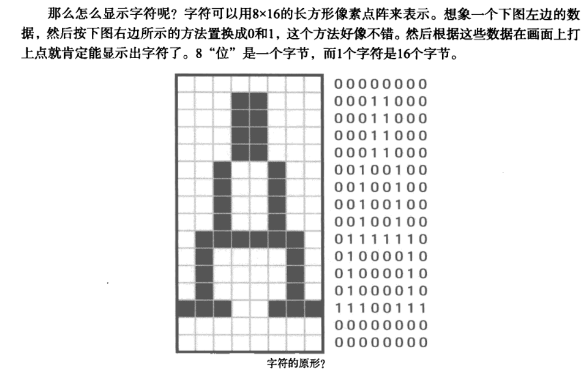
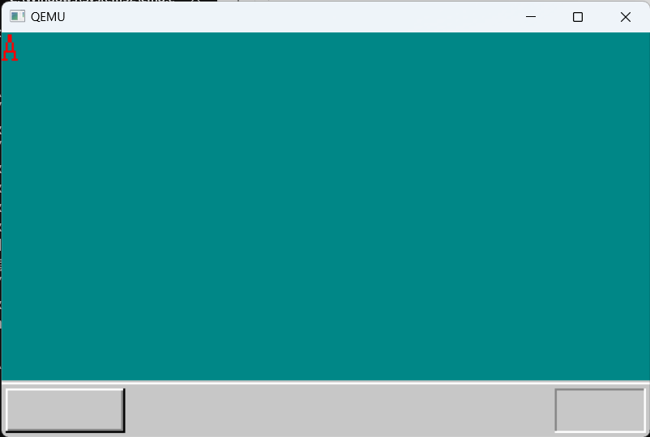
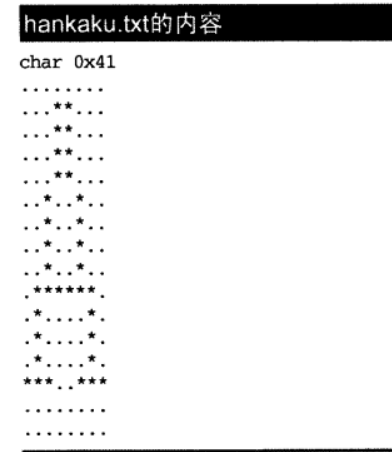
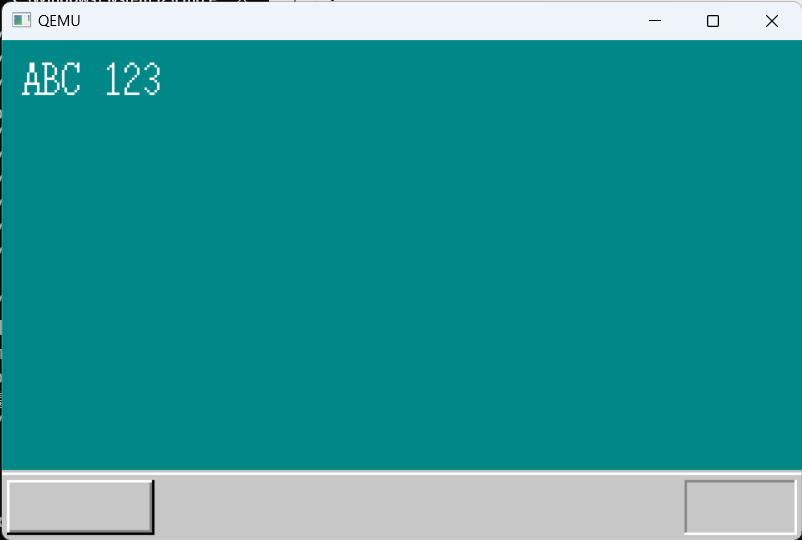
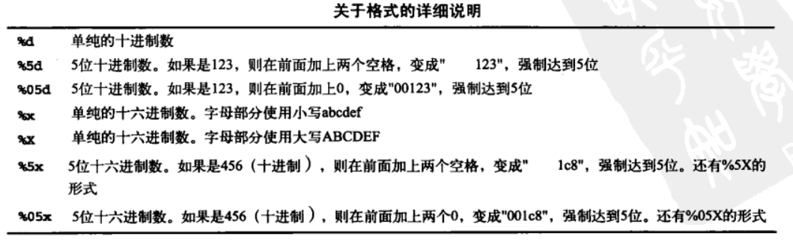
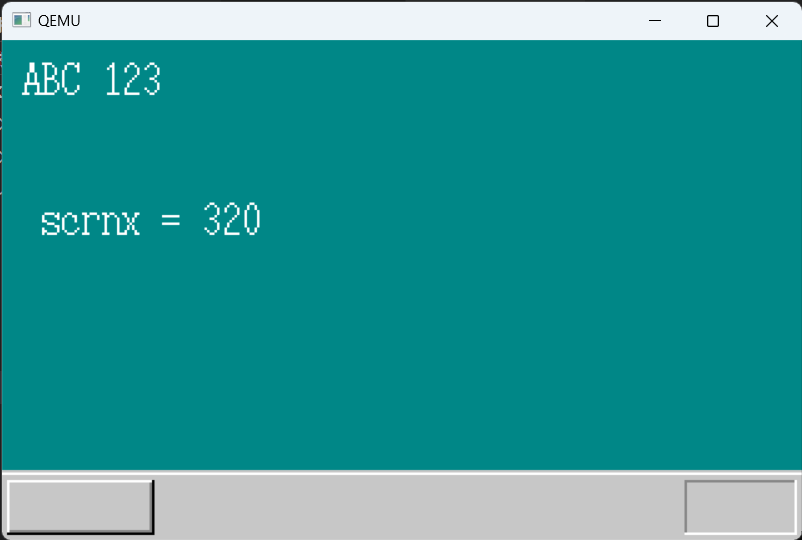
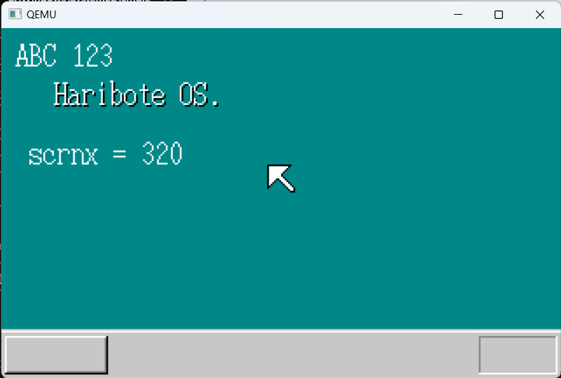

# 结构体、文字显示与GDT

## 5.1 接受启动信息

到昨天为止，在bootpack.c里的，都是将0xa0000呀，320、200等数字直接写入程序

而本来这些值应该从asmhead.nas先前保存下来的值中取。如果不这样做的话，当画面模式改变时，系统就不能正确运行。

```c
void HariMain(void)
{
	char *vram;/* 声明变量vram、用于BYTE [...]地址 */
	int xsize, ysize;

	short *binfo_scrnx,*binfo_scrny;
	int *binfo_vram;

	init_palette();/* 设定调色板 */
	// vram = (char *) 0xa0000;/* 地址变量赋值 *///显存开始地址
	// xsize = 320;
	// ysize = 200;

	binfo_scrnx =(short *)0x0ff4;
	binfo_scrny =(short *) 0x0ff6;
	binfo_vram =(int *)0x0ff8;
	xsize = *binfo_scrnx;
	ysize = *binfo_scrny;
	vram =(char *)*binfo_vram;
```


这里出现的0x0ff4之类的地址到底是从哪里来的呢?其实这些地址仅仅是为了与asmhead.

nas保持一致才出现的。

## 5.2试用结构体

```c
struct BCOTINFO {
    char cyls, leds, vmode, reserve;
    short scrnx,scrny;
    char *vram;
};
void HariMain(void)
{
    char *vram;
    int xsize, ysize;
    struct BOOTINFO *binfo;
    init_palette();
    binfo =(struct BOOTINFO *) 0x0ff0;
    xsize =(*binfo).scrnx;
    ysize =(*binfo).scrmy;
    vram =(*binfo).vram;
```

为了表示其中的scmx,使用了(*binfo).scrnx这种写法。

如果不加括号直接写成*binfo.scrnx,虽然更容易懂，但编译器会误解成*(binfo.scrnx),出现错

误。所以，括号虽然不太好看，但不能省略。

## 5.3试用箭头记号

使用箭头，可以将“xsize=(*binfo).scmx;”写成“xsize=binfo->scmx;”

```c
void HariMain(void)
(
    struct BOOTINFO *binfo =(struct BOOTINFO *)0x0ff0;
    init_palette();
    init_screen(binfo->vram, binfo->scrnx, binfo->scrny);
```


## 5.4 显示字符

到昨天为止，我们算是画出了一幅稍微像样的画，今天就来在画面上写字。

`**以前我们显示字符主要靠调用BIOS函数，但这次是32位模式，不能再依赖BIOS了，只能自力更生。**`

那么怎么显示字符呢?字符可以用8×16的长方形像素点阵来表示。



像这种描画文字形状的数据称为字体(font)数据，那这种字体数据是怎样写到程序里的呢?

有一种临时方案：

```c
static char font_A[16] = {
    0x00,0x18,0x18,0x18,0x18,0x24,0x24,0x24,
    0x24,0x7e,0x42,0x42,0x42,0xe7,0x00,0x00
};
```

数据齐备之后，只要描画到画面上就可以了。用for语句将画8个像素的程序循环16遍，就可

以显示出一个字符了。于是我们制作了下面这个函数。

```c
void putfont8(char *vram, int xsize,int x, int y,char c,char *font)
{
    int i;
    char d; /* data */
    for(i=0;i<16;i++){//用for语句将画8个像素的程序循环16遍
        d = font[i];
        if((d&0x80)!=0){vram[(y+i)*xsize+x+0]=c;}
        if((d&0x40)!=0){ vram[(y+i)*xsize+x+1]=c;}
        if((d&0x20)!=0){ vram[(y+i)*xsize+x+2]=c;}
        if((d& 0x10)!=0){vram[(y+i)*xsize+x+3]=c;)
        if((d& 0x08)!=0){ vram[(y+i)*xsize+x+4]=c;}
        if((d& 0x04)!=0)( vram[(y+i)*xsize+x+5]=c;}
        if((d&0x02)!=0){ vram[(y+i)*xsize+x+6]=c;}
        if((d&0x01)!=0){ vram[(y+i)*xsize+x+7]=c;}
    }
    return;
}
```


```c
void putfont8(char *vram, int xsize,int x, int y,char c,char *font)
{
    int i;
	char *p,d /* data */;
    for(i=0;i<16; i++){//用for语句将画8个像素的程序循环16遍
        p= vram +(y+i)*xsize +x;
        d= font[i];
        if((d&0x80)!=0){p[0]=c;}
        if((d&0x40)!=0){p[1]=c;}
        if((d&0x20)!=0){p[2]=c;}
        if((d& 0x10)!=0){p[3]=c; }
        if((d& 0x08)!=0){p[4]=c;}
        if((d& 0x04)!=0){p[5]=c; }
        if((d&0x02)!=0){p[6]=c;}
        if((d& 0x01)!=0){p[7]=c;}
    }
    return;
}
```


完整程序及显示效果:

```c
void io_hlt(void);
void io_cli(void);
void io_out8(int port, int data);
int io_load_eflags(void);
void io_store_eflags(int eflags);

void init_palette(void);
void set_palette(int start, int end, unsigned char *rgb);
void boxfill8(unsigned char *vram, int xsize, unsigned char c, int x0, int y0, int x1, int y1);
void init_screen(char *vram, int xsize, int ysize);
void putfont8(char *vram, int xsize,int x, int y,char c,char *font);


#define COL8_000000		0
#define COL8_FF0000		1
#define COL8_00FF00		2
#define COL8_FFFF00		3
#define COL8_0000FF		4
#define COL8_FF00FF		5
#define COL8_00FFFF		6
#define COL8_FFFFFF		7
#define COL8_C6C6C6		8
#define COL8_840000		9
#define COL8_008400		10
#define COL8_848400		11
#define COL8_000084		12
#define COL8_840084		13
#define COL8_008484		14
#define COL8_848484		15

struct BOOTINFO {
    char cyls, leds, vmode, reserve;
    short scrnx,scrny;
    char *vram;
};
static char font_A[16] = {
    0x00,0x18,0x18,0x18,0x18,0x24,0x24,0x24,
    0x24,0x7e,0x42,0x42,0x42,0xe7,0x00,0x00
};
void HariMain(void)
{
 	struct BOOTINFO *binfo =(struct BOOTINFO *)0x0ff0;

    init_palette();
    init_screen(binfo->vram, binfo->scrnx, binfo->scrny);

	putfont8(binfo->vram,binfo->scrnx,0,0,COL8_FF0000,font_A);
	

	for (;;) {
		io_hlt();
	}
}

void init_screen(char *vram, int xsize, int ysize)
{
	/* 根据 0xa0000 + x + y * 320 计算坐标 8*/
	boxfill8(vram, xsize, COL8_008484,  0,         0,          xsize -  1, ysize - 29);
	boxfill8(vram, xsize, COL8_C6C6C6,  0,         ysize - 28, xsize -  1, ysize - 28);
	boxfill8(vram, xsize, COL8_FFFFFF,  0,         ysize - 27, xsize -  1, ysize - 27);
	boxfill8(vram, xsize, COL8_C6C6C6,  0,         ysize - 26, xsize -  1, ysize -  1);

	boxfill8(vram, xsize, COL8_FFFFFF,  3,         ysize - 24, 59,         ysize - 24);
	boxfill8(vram, xsize, COL8_FFFFFF,  2,         ysize - 24,  2,         ysize -  4);
	boxfill8(vram, xsize, COL8_848484,  3,         ysize -  4, 59,         ysize -  4);
	boxfill8(vram, xsize, COL8_848484, 59,         ysize - 23, 59,         ysize -  5);
	boxfill8(vram, xsize, COL8_000000,  2,         ysize -  3, 59,         ysize -  3);
	boxfill8(vram, xsize, COL8_000000, 60,         ysize - 24, 60,         ysize -  3);

	boxfill8(vram, xsize, COL8_848484, xsize - 47, ysize - 24, xsize -  4, ysize - 24);
	boxfill8(vram, xsize, COL8_848484, xsize - 47, ysize - 23, xsize - 47, ysize -  4);
	boxfill8(vram, xsize, COL8_FFFFFF, xsize - 47, ysize -  3, xsize -  4, ysize -  3);
	boxfill8(vram, xsize, COL8_FFFFFF, xsize -  3, ysize - 24, xsize -  3, ysize -  3);
}
void putfont8(char *vram, int xsize,int x, int y,char c,char *font)
{
    int i;
	char *p,d /* data */;
    for(i=0;i<16; i++){//用for语句将画8个像素的程序循环16遍  c是color
        p= vram +(y+i)*xsize +x;
        d= font[i];
        if((d&0x80)!=0){p[0]=c;}
        if((d&0x40)!=0){p[1]=c;}
        if((d&0x20)!=0){p[2]=c;}
        if((d& 0x10)!=0){p[3]=c; }
        if((d& 0x08)!=0){p[4]=c;}
        if((d& 0x04)!=0){p[5]=c; }
        if((d&0x02)!=0){p[6]=c;}
        if((d& 0x01)!=0){p[7]=c;}
    }
    return;
}
void init_palette(void)
{
	static unsigned char table_rgb[16 * 3] = {
		0x00, 0x00, 0x00,	/*  0:黑 */
		0xff, 0x00, 0x00,	/*  1:梁红 */
		0x00, 0xff, 0x00,	/*  2:亮绿 */
		0xff, 0xff, 0x00,	/*  3:亮黄 */
		0x00, 0x00, 0xff,	/*  4:亮蓝 */
		0xff, 0x00, 0xff,	/*  5:亮紫 */
		0x00, 0xff, 0xff,	/*  6:浅亮蓝 */
		0xff, 0xff, 0xff,	/*  7:白 */
		0xc6, 0xc6, 0xc6,	/*  8:亮灰 */
		0x84, 0x00, 0x00,	/*  9:暗红 */
		0x00, 0x84, 0x00,	/* 10:暗绿 */
		0x84, 0x84, 0x00,	/* 11:暗黄 */
		0x00, 0x00, 0x84,	/* 12:暗青 */
		0x84, 0x00, 0x84,	/* 13:暗紫 */
		0x00, 0x84, 0x84,	/* 14:浅暗蓝 */
		0x84, 0x84, 0x84	/* 15:暗灰 */
	};
	set_palette(0, 15, table_rgb);
	return;

	/* C语言中的static char语句只能用于数据，相当于汇编中的DB指令 */
}

void set_palette(int start, int end, unsigned char *rgb)
{
	int i, eflags;
	eflags = io_load_eflags();	/* 记录中断许可标志的值 */
	io_cli(); 					/* 将中断许可标志置为0,禁止中断 */
	io_out8(0x03c8, start);
	for (i = start; i <= end; i++) {
		io_out8(0x03c9, rgb[0] / 4);
		io_out8(0x03c9, rgb[1] / 4);
		io_out8(0x03c9, rgb[2] / 4);
		rgb += 3;
	}
	io_store_eflags(eflags);	/* 复原中断许可标志 */
	return;
}

void boxfill8(unsigned char *vram, int xsize, unsigned char c, int x0, int y0, int x1, int y1)
{
	int x, y;
	for (y = y0; y <= y1; y++) {
		for (x = x0; x <= x1; x++)
			vram[y * xsize + x] = c;
	}
	return;
}
```




## 5.5增加字体

虽然字符“A”显示出来了，但这段程序只能显示“A”而不能显示别的字符。所以我们需

要很多别的字体来显示其他字符。英文字母就有26个，分别有大写和小写，还有10个数字，再加

上各种符号肯定超过30个了。啊，还有很多，太麻烦了，所以我们**决定沿用OSASK的字体数据**。

当然，我们暂时还不考虑显示汉字什么的。这些复杂的东西，留待以后再做。现在我们集中精力

解决字母显示的问题。


这次就将hankaku.txt这个文本文件加入到我们的源程序大家庭中来

下面是 字母A 对应内容




当然，这既不是C语言，也不是汇编语言，所以需要专用的编译器。新做一个编译器很麻烦，

所以我们还是使用在制作OSASK时曾经用过的工具(makefont.exe)。说是编译器，其实有点言

过其实了，**只不过是将上面这样的文本文件(256个字符的字体文件)读进来，然后输出成**

**16×256=4096字节的文件而已**。

`编译后生成hankaku.bin文件，但仅有这个文件还不能与bootpack.obj连接，因为它不是目标(obj)文件。所以，还要加上连接所必需的接口信息，将它变成目标文件。`

这项工作由bin2obj.exe来完成。

它的功能是将所给的文件自动转换成目标程序，就像将源程序转换成汇编那样。也就是

说，好像将下面这两行程序编译成了汇编：

_hankanku:

DB 各种数据(共4096字节)

当然，如果大家不喜欢现在这种字体的话，可以随便修改hankaku.txt。本书的中心任务是自

制操作系统，所以字体就由大家自己制作了。


`如果在C语言中使用这种字体数据，只需要写上以下语句就可以了。`

`extern char hankaku[4096];`

像这种在源程序以外准备的数据，都需要加上extern属性。这样，C编译器就能够知道它是外部数据，并在编译时做出相应调整。


**OSASK的字体数据，依照一般的ASCI字符编码，含有256个字符。A的字符编码是0x41,所**

**以A的字体数据，放在自“hankaku+0x41*16”开始的16字节里。C语言中A的字符编码可以用’A'**

**来表示，正好可以用它来代替0x41,所以也可以写成“hankaku+‘A'*16”。**


```c
void HariMain(void)
{
 	struct BOOTINFO *binfo =(struct BOOTINFO *)0x0ff0;
    extern char hankaku[4096];
    init_palette();
    init_screen(binfo->vram, binfo->scrnx, binfo->scrny);

	putfont8(binfo->vram,binfo->scrnx, 8,8,COL8_FFFFFF,hankaku +'A'* 16);
    putfont8(binfo->vram,binfo->scrnx,16,8,COL8_FFFFFF,hankaku +'B'* 16);
    putfont8(binfo->vram,binfo->scrnx,24,8,COL8_FFFFFF,hankaku + 'C'* 16);
    putfont8(binfo->vram,binfo->scrnx, 40,8,COL8_FFFFFF,hankaku +'1'*16);
    putfont8(binfo->vram,binfo->scrnx,48,8,COL8_FFFFFF,hankaku +'2'* 16);
    putfont8(binfo->vram,binfo->scrnx,56,8,COL8_FFFFFF, hankaku +'3'* 16);

	for (;;) {
		io_hlt();
	}
}
```

```makefile
hankaku.bin: hankaku.txt Makefile
	$(MAKEFONT) hankaku.txt hankaku.bin
hankaku.obj: hankaku.bin Makefile
	$(BIN2OBJ) hankaku.bin hankaku.obj _hankaku


bootpack.bim : bootpack.obj naskfunc.obj hankaku.obj Makefile
	$(OBJ2BIM) @$(RULEFILE) out:bootpack.bim stack:3136k map:bootpack.map \
		bootpack.obj naskfunc.obj hankaku.obj
```




## 5.6显示字符串

在putfonts8的基础上制作一个显示字符串的函数

```c
void putfonts8_asc(char *vram, int xsize, int x,int y,char c,unsigned char *s)
{
	extern char hankaku[4096];
	for(;*s!= 0x00; s++){
		putfont8(vram,xsize,x,y,c,hankaku + *s* 16);
		x+= 8;
	}
	return;
}
```

C语言中，字符串都是以0x00结尾的，所以可以这么写。函数名带着asc,是为了提醒笔者字

符编码使用了ASCI。

所谓字符串是指按顺序排列在内存里，末尾加上0x00而组成的字符编码。所以s是指字符串前头的地址，而使用*s就可以读取字符编码。这样，仅利用下面这短短的一行代码就能够达到目的了

```c
putfonts8_asc(binfo->vram,binfo->scrnx, 8,8,COL8_FFFFFF,"ABC 123*);
```


## 5.7显示变量值

习惯了在Windows中开发程序的人，如果想看到变量的值，用调试器①(debugger)很容易就能看到，但是在开发操作系统过程中可就没那么容易了。就像用Windows的调试器不能对Linux的程序进行调试一样，Windows的调试器也不能对我们的“纸娃娃操作系统”的程序进行调试，更不要说对操作系统本身进行调试了。如果在“纸娃娃操作系统”中也要使用调试器的话，那只有自己做一个调试器了(也可以移植)。**在做出调试器之前，只能通过显示变量值来查看确认问题的地方。**


闲话就说这么多，让我们回到正题。那怎么样显示变量的值呢?可以使用sprintf函数。

它是printf函数的同类，与printf函数的功能很相近。`在开始的时候，我们曾提到过，自制操作系统中不能随便使用printf函数，但sprintf可以使用。`因为sprintf不是按指定格式输出，只是将输出内容作为字符串写在内存中

这个sprintf函数，是本次使用的名为GO的C编译器附带的函数。它在制作者的精心设计之下能够不使用操作系统的任何功能。


我们这就来试试这个函数吧。要在C语言中使用sprintf函数，就必须在源程序的开头写上#include<stdio.h>,我们也写上这句话。这样以后就可以随便使用sprintf函数了。接下来在HariMain中使用sprintf函数。

```c
sprintf(s,"scrnx = sd",binfo->scrnx);
putfonts8_asc(binfo->vram,binfo->scmx,16,64,COL8_FFFFFF,s);
```


sprintf函数的使用方法是：sprintf(地址，格式，值，值，值，……)。这里的地址指定所生

成字符串的存放地址。格式基本上只是单纯的字符串，如果有%d类记号，就置换成后面的值

的内容。除了%d还有%s,%x等符号，它们用于指定数值以什么方式变换为字符串。%d数

值作为十进制数转化为字符串，%x将数值作为十六进制数转化为字符串。



```c
void HariMain(void)
{
 	struct BOOTINFO *binfo =(struct BOOTINFO *)0x0ff0;
    extern char hankaku[4096];
    init_palette();
    init_screen(binfo->vram, binfo->scrnx, binfo->scrny);

	putfont8(binfo->vram,binfo->scrnx, 8,8,COL8_FFFFFF,hankaku +'A'* 16);
    putfont8(binfo->vram,binfo->scrnx,16,8,COL8_FFFFFF,hankaku +'B'* 16);
    putfont8(binfo->vram,binfo->scrnx,24,8,COL8_FFFFFF,hankaku + 'C'* 16);
    putfont8(binfo->vram,binfo->scrnx, 40,8,COL8_FFFFFF,hankaku +'1'*16);
    putfont8(binfo->vram,binfo->scrnx,48,8,COL8_FFFFFF,hankaku +'2'* 16);
    putfont8(binfo->vram,binfo->scrnx,56,8,COL8_FFFFFF, hankaku +'3'* 16);
	char*s;
	sprintf(s,"scrnx = %d",binfo->scrnx);
	putfonts8_asc(binfo->vram,binfo->scrnx,16,64,COL8_FFFFFF,s);

	for (;;) {
		io_hlt();
	}
}
```




## 5.8显示鼠标指针

再描画一下鼠标指针吧。思路跟显示字符差不多，程序并不是很难。

首先，将鼠标指针的大小定为16×16。这个定下来之后，下面就简单了。先准备16×16=256

字节的内存，然后往里面写入鼠标指针的数据。我们把这个程序写在init_mouse_cursor8里。

```c

void init_mouse_cursor8(char *mouse, char bc)
{
    //变量bc是指back-color,也就是背景色。
	static char cursor[16][16] = {
		"**************..",
		"*OOOOOOOOOOO*...",
		"*OOOOOOOOOO*....",
		"*OOOOOOOOO*.....",
		"*OOOOOOOO*......",
		"*OOOOOOO*.......",
		"*OOOOOOO*.......",
		"*OOOOOOOO*......",
		"*OOOO**OOO*.....",
		"*OOO*..*OOO*....",
		"*OO*....*OOO*...",
		"*O*......*OOO*..",
		"**........*OOO*.",
		"*..........*OOO*",
		"............*OO*",
		".............***"
	};
	int x, y;

	for (y = 0; y < 16; y++) {
		for (x = 0; x < 16; x++) {
			if (cursor[y][x] == '*') {
				mouse[y * 16 + x] = COL8_000000;
			}
			if (cursor[y][x] == 'O') {
				mouse[y * 16 + x] = COL8_FFFFFF;
			}
			if (cursor[y][x] == '.') {
				mouse[y * 16 + x] = bc;
			}
		}
	}
	return;
}
```

变量bc是指back-color,也就是背景色。

要将鼠标显示出来，还需要作成下面这个函数。其实很简单，只要将buf中的数据复制到vram中去就可以了。

```c
void putblock8_8(char *vram, int vxsize, int pxsize,
	int pysize, int px0, int py0, char *buf, int bxsize)
{
	int x, y;
	for (y = 0; y < pysize; y++) {
		for (x = 0; x < pxsize; x++) {
			vram[(py0 + y) * vxsize + (px0 + x)] = buf[y * bxsize + x];
		}
	}
	return;
}
```

里面的变量有很多，其中vram和vxsize是关于VRAM的信息。他们的值分别是0xa0000和320。

pxsize和pysize是想要显示的图形(picture)的大小，鼠标指针的大小是16×16,所以这两个值都

是16。px0和py0指定图形在画面上的显示位置。最后的buf和bxsize分别指定图形的存放地址和每

一行含有的像素数。bxsize和pxsize大体相同，但也有时候想放入不同的值，所以还是要分别指定

这两个值。

接下来，只要使用以下两个函数就行了

```c
init_mouse_cursor8(mcursor,COL8_008484);
putblock8_8(binfo->vram,binfo->scrnx,16,16,mx,my,mcursor,16);
```





## 5.9 GDT与IDT的初始化

***GDT是“global(segment)descriptortable”的缩写，意思是全局段号记录表***

***IDT是“interrupt descriptor table”的缩写，直译过来就是“中断记录表”***


鼠标指针显示出来了，我们想做的第一件事就是去移动它，但鼠标指针却一动不动。那是当然，因为我们还没有做出这个功能。……嗯，无论如何想让它动起来。

要怎么样才能让它动呢?……(思考中)……有办法了!首先要将GDT和IDT初始化。不过

在此之前，**必须说明一下什么是GDT和IDT。**


GDT也好，IDT也好，它们都是与CPU有关的设定。为了让操作系统能够使用32位模式，需

要对CPU做各种设定。不过，asmhead.nas里写的程序有点偷工减料，只是随意进行了一些设定。

如果这样原封不动的话，就无法做出使用鼠标指针所需要的设定，所以我们要好好重新设置一下。


**先来讲一下分段**①。回想一下仅用汇编语言编程时，有一个指令叫做ORG。如果不用ORG指令明确声明程序要读入的内存地址，就不能写出正确的程序来。

**如果写着ORG 0x1234,但程序却没读人内存的0x1234号，可就不好办了。**

`发生这种情况是非常麻烦的。最近的操作系统能同时运行多个程序，这一点也不稀奇。这种时候，如果内存的使用范围重叠了怎么办?这可是一件大事。必须让某个程序放弃执行，同时报出一个“因为内存地址冲突，不能执行”的错误信息。但是，这种错误大家见过吗?没有。所以，肯定有某种方法能解决这个问题。这个方法就是`**分段**。


所谓分段，打个比方说，就是按照自己喜欢的方式，将合计4GB°的内存分成很多块(block),每一块的起始地址都看作0来处理。这很方便，有了这个功能，任何程序都可以先写上一句ORG0。像这样分割出来的块，就称为段(segment)。顺便说一句，如果不用分段而用分页②(paging),也能解决问题。不过我们目前还不讨论分页，可以暂时不考虑它。


为了表示一个段，需要有以下信息。

口段的大小是多少

口段的起始地址在哪里

口段的管理属性(禁止写入，禁止执行，系统专用等)

CPU用8个字节(=64位)的数据来表示这些信息。但是，用于指定段的寄存器只有16位。或许有人会猜想在32位模式下，段寄存器会扩展到64位，但事实上段寄存器仍然是16位。

**那该怎么办才好呢?可以模仿图像调色板的做法。也就是说，先有一个段号③,存放在段寄存器里。然后预先设定好段号与段的对应关系**


色号可以使用0~255的数。段号可以用0~8191的数。因为段寄存器是16位，所以本来应该能够处理0~65535范围的数，但由于CPU设计上的原因，段寄存器的低3位不能使用。因此能够使用的段号只有13位，能够处理的就只有位于0~8191的区域了。


`段号怎么设定呢?这是对于CPU的设定，不需要像调色板那样使用io_out(由于不是外部设备，当然没必要)。`

`但因为能够使用0~8191的范围，即可以定义8192个段，所以设定这么多段就需要8192×8=65536字节(64KB)。`

`大家可能会想，CPU没那么大存储能力，不可能存储那么多数据，是不是要写入到内存中去呀。不错，正是这样。这64KB(实际上也可以比这少)的数据就称为GDT。`


GDT是“global(segment)descriptortable”的缩写，意思是全局段号记录表。将这些数据整

齐地排列在内存的某个地方，然后将内存的起始地址和有效设定个数放在CPU内被称作`GDTR`①的

特殊寄存器中，设定就完成了。


IDT记录了0~255的中断号码与调用函数的对应关系，比如说发生了123号中断，就调用O×函数，其设定方法与GDT很相似(或许是因为使用同样的方法能简化CPU的电路)。


如果段的设定还没顺利完成就设定IDT的话，会比较麻烦，所以必须先进行GDT的设定。


```c
struct SEGMENT_DESCRIPTOR{//放GDT的8字节的内容
    short limit_low,base_low;
    char base_mid, access_right;
    char limit_high, base_high;
};
struct GATE_DESCRIPTOR {//存放IDT的8字节的
    short offset_low,selector;
    char dw_count,access_right;
    short offset_high;
};
void init_gdtidt(void)
{
    //将0x270000～0x27fr设为GDT。
    struct SEGMENT_DESCRIPTOR *gdt =(struct SEGMENT_DESCRIPTOR *)0x00270000;
    //，IDT被设为了0x26f800～0x26ff
    struct GATE_DESCRIPTOR *idt =(struct GATE_DESCRIPTOR *)0x0026f800;
    int i;
    /* GDT的初始化 */
    for(i=0;i<8192;i++){
    	set_segmdesc(gdt + i,0,0,0);
    }
    set_segmdesc(gdt + 1,0xffffffff,0x00000000,0x4092);
    set_segmdesc(gdt + 2,0x0007ffff,0x00280000,0x409a);
    load_gatr(0xffff,0x00270000);
    /* IDT的初始化 */
    for(i=0;i<256;i++){
    set_gatedesc(idt + i,0,0,0);
    }
    load_gdtr(0x7ff,0x0026f800);
	return;
}

void set_segmdesc(struct SEGMENT_DESCRIPTOR *sd, unsigned int limit, int base, int ar)
{
    if(limit> 0xfffff){
        ar |= 0x8000;/*G_bit =1*/
        limit /= 0x1000;
    }
    sd->limit_low = limit & 0xffff;
    sd->base_low = base & 0xffff;
    sd->base_mid =(base >> 16)& 0xff;
    sd->access_right = ar & 0xff;
    sd->limit_high =((limit >> 16)& 0x0f)|((ar >> 8)& 0xf0);
    sd->base_high =(base >> 24)& 0xff;
    return;
}
void set_gatedesc(struct GATE_DESCRIPTOR *gd, int offset, int selector, int ar)
{
    gd->offset_low = offset & 0xffff;
    gd->selector = selector;
    gd->dw_count =(ar >> 8)& 0xff;
    gd->access_right = ar & 0xff;
    gd->offset_high =(offset >> 16)& 0xffff;
    return;
}
```


```c
set_segmdesc(gdt +1,Oxffffffff,Ox00000000,0x4092);
set_segmdesc(gdt + 2,0x0007ffff,0x00280000,0x409a);
```

段号为1的段，上限值为0xfmm即大小正好是4GB),地址是0,它表示的是CPU所能管理的全部内存本身。段的属性设为0x4092,它的含义我们留待明天再说。

下面来看看段号为2的段，它的大小是512KB,地址是0x280000。这正好是为bootpack.hrb而准备的。用这个段，就可以执行bootpack.hrb。因为bootpack.hrb是以ORG 0为前提翻译成的机器语言


```c
load_gdtr(0xffff,0x00270000);
```

这是因为依照常规，C语言里不能给GDTR赋值，所以要借助汇编语言的力量，仅此而已。


```asm
;naskfunc.nas
_load_gdtr:		; void load_gdtr(int limit, int addr);
		MOV		AX,[ESP+4]		; limit
		MOV		[ESP+6],AX
		LGDT	[ESP+6]
		RET

_load_idtr:		; void load_idtr(int limit, int addr);
		MOV		AX,[ESP+4]		; limit
		MOV		[ESP+6],AX
		LIDT	[ESP+6]
		RET
```

