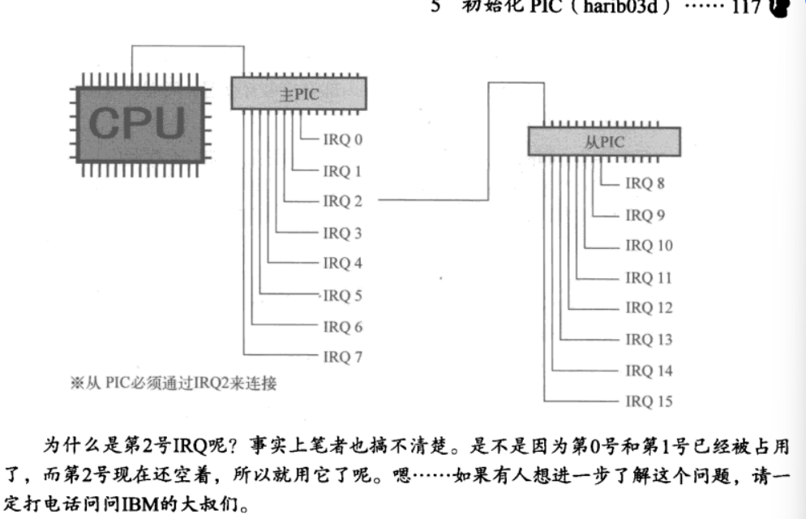

# 分割编译与中断处理


## 6.1 分割源文件

看一下bootpack.c,发现它竟然已长达近300行，是太长了点。所以我们决定把它分割为几部分。


分割并不是很难，但有一点很关键。

`比如如果graphic.c也想使用naskfunc.nas的函数，就必须要写上“voidio_out8(intport,int data);”这种函数声明。虽然这都已经写在bootpack.c里了，但编译器在编译graphic.c时，根本不知道有bootpack.c存在。`


## 6.2整理Makefile

```makefile
bootpack.gas :bootpack.c Makefile
$(CCl)-o bootpack.gas bootpack.c
graphic.gas :graphic.c Makefile
$(CC1)-o graphic.gas graphic.c
dsctbl.gas:dsctbl.c Makefile
$(CC1)-o dsctbl.gas dsctbl.c
```


替换为

```makefile
%.gas :%.c Makefile
	$(CC1) -o $*.gas $*.c
%.nas :$.gas Makefile
	$(GAS2NASK)$*.gas $*.nas
```

make.exe会首先寻找普通的生成规则，如果没找到，就尝试用一般规则。所以，即使一般规

则和普通生成规则有冲突，也不会有问题。这时候，普通生成规则要优于一般规则。比如虽然某

个文件的扩展名也是.c,但是想用单独的规则来编译它，这也没问题。

## 6.3整理头文件

各个源文件都要重复声明“voldio_out8( int port,int data);”等


首先将重复部分全部去掉，把他们归纳起来，放到名为bootpack.h的文件里。虽然扩展名变了，但它也是C语言的文件。已经有一个文件名叫bootpack.c了，我们根据一般的做法，将文件命名为bootpack.h。


这个文件里不仅仅罗列出了函数的定义，还在注释中写明了函数的定义在哪一个源文件里。想要看一看或者修改函数定义时，只要看一下文件bootpack.h就能知道该函数定义本身在哪个源文件里。这就像目录一样，很方便。

在编译graphic.c的时候，我们要让编译器去读这个头文件，做法是在graphic.c的前面加上如下一行

```c
#include "bootpack.h"
```


***编译器见到了这一行，就将该行替换成所指定文件的内容，然后进行编译。***

所以，在“bootpack.h”里的所有内容，也都间接地写到了“graphic.c”中。同样道理，在“dsctbl.c”和“bootpack.c”的前面也都加上一行“#include "bootpack.h"”。


像这样，仅由函数声明和#define等组成的文件，我们称之为头文件。

双引号("*)表示该头文件与源文件位于同一个文件夹里，而尖括号(<>)则表示该头文件位于编译器所提供的文件夹里。

-------------------------------------------


好了，现在来详细讲一下昨天遗留下来的问题。

先来说明一下naskfunc.nas的_load_gdtr。

```asm
_load_gdtr: ;void loadgdtr(int limit, int addr);
    MOV AX,[ESP+4] ;limit
    MOV [ESP+6],AX
    LGDT [ESP+6]
	RET
```

这个函数用来将指定的段上限(limit)和地址值赋值给名为GDTR的48位寄存器。


这是一个很特别的48位寄存器，并不能用我们常用的MOV指令来赋值。给它赋值的时候，唯一的方法就是指定一个内存地址，从指定的地址读取6个字节(也就是48位),然后赋值给GDTR寄存器。


该寄存器的低16位(即内存的最初2个字节)是段上限，它等于“GDT的有效字节数-1”。今后我们还会偶尔用到上限这个词，意思都是表示量的大小，一般为“字节数-1”。剩下的高32位(即剩余的4个字节),代表GDT的开始地址。


在最初执行这个函数的时候，DWORD[ESP+4]里存放的是段上限，DWORD[ESP+8]里存放的是地址。具体到实际的数值，就是0x0000ffff和Ox00270000。

把它们按字节写出来的话，就成了[FF FF 00 00 00 27 00] (要注意低位放在内存地址小的字节里)。为了执行LGDT,笔者希望把它们排列成[FF FF 00 270000]的样子，所以就先用“MOVAX,[ESP+4]”读取最初的0xffff,然后再写到[ESP+6]里。这样，结果就成了[FF FF FF FF 00 27 00 00],如果从[ESP+6]开始读6字节的话，正好是我们想要的结果。


naskfunc.nas的_load_idtr设置IDTR的值，因为IDTR与GDTR结构体基本上是一样的，程序也非常相似。

----------------------------

最后再补充说明一下dsctbl.c里的set_segmdesc函数。

```c
struct SEGMENT_DESCRIPTOR {
    short limit_low,base_low;
    char base_mid,access_right;
    char limit_high, base_high;
};
void set_segmdesc(struct SEGMENT_DESCRIPTOR *sd, unsigned int limit, int base, int ar)
{
    if(limit> 0xfffff){
        ar |= 0x8000;/*G_bit =1*/
        limit /= 0x1000;
    }
    sd->limit_low = limit & Oxffff;
    sd->base_low = base & 0xffff;
    sd->base_mid =(base >> 16)& 0xff;
    sd->access_right = ar & 0xff;
    sd->limit_high =((limit >> 16)& 0x0f)l((ar >> 8)& 0xf0);
    sd->base_high =(base >> 24)& Oxff;
    return;
}
```


说到底，这个函数是按照CPU的规格要求，将段的信息归结成8个字节写入内存的

口 段的大小

口 段的起始地址

口 段的管理属性(禁止写人，禁止执行，系统专用等)

首先看一下段的地址。地址当然是用32位来表示。这个地址在CPU世界的语言里，被称为段

的基址。所以这里使用了base这样一个变量名。在这个结构体里base又分为low(2字节),mid(1

字节),high(1字节)3段，合起来刚好是32位。所以，这里只要按顺序分别填入相应的数值就行

了。虽然有点难懂，但原理很简单。程序中使用了移位运算符和AND运算符往各个字节里填入相

应的数值。

**为什么要分为3段呢?主要是为了与80286时代的程序兼容。有了这样的规格，80286用的操**

**作系统，也可以不用修改就在386以后的CPU上运行了。**


下面再说一下段上限。它表示一个段有多少个字节。可是这里有一个问题，段上限最大是

4GB,也就是一个32位的数值，如果直接放进去，这个数值本身就要占用4个字节，再加上基址

(base),一共就要8个字节，这就把整个结构体占满了。这样一来，就没有地方保存段的管理属

性信息了，这可不行。

**因此段上限只能使用20位。这样一来，段上限最大也只能指定到1MB为止。**明明有4GB,却

只能用其中的1MB,有种又回到了16位时代的错觉，太可悲了。在这里英特尔的叔叔们又想了一

个办法，**他们在段的属性里设了一个标志位，叫做Gbit。这个标志位是1的时候，limit的单位不解**

**释成字节(byte),而解释成页(page)。**页是什么呢?在电脑的CPU里，1页是指4KB。

**在电脑的CPU里，1页是指4KB。这样一来，4KB×1M=4GB,所以可以指定4GB的段。**总算能放心了。顺便说一句，G bit的“G”,是“granularity”的缩写，是指单位的大小。


这20位的段上限分别写到limit_low和limit_high里。看起来它们好像是总共有3字节，即24位，但实际上我们接着要把段属性写入limit high的上4位里，所以最后段上限还是只有20,


最后再来讲一下12位的段属性。段属性又称为“段的访问权属性”,在程序中用变量名access_right或ar来表示。因为12位段属性中的高4位放在limit_high的高4位里，所以程序里有意把ar当作如下的16位构成来处理：


ar的高4位被称为“扩展访问权”。为什么这么说呢?因为这高4位的访问属性在80286的时代还不存在，到386以后才可以使用。这4位是由“GD00”构成的，其中G是指刚才所说的G bit,D是指段的模式，1是指32位模式，0是指16位模式。这里出现的16位模式主要只用于运行80286的程序，不能用于调用BIOS。所以，除了运行80286程序以外，通常都使用D=1的模式。


ar的低8位从80286时代就已经有了，如果要详细说明的话，够我们说一天的了，所以这里只

是简单地介绍一下。

00000000(0x00):未使用的记录表(descriptor table)。

10010010(0x92):系统专用，可读写的段。不可执行。

**10011010(0x9a):系统专用，可执行的段。可读不可写。**

11110010(0xf2):应用程序用，可读写的段。不可执行。

**11111010(0xfa):应用程序用，可执行的段。可读不可写**

在32位模式下，CPU有系统模式(也称为“ring0”①)和应用模式(也称为“ring3”)之分。操作系统等“管理用”的程序，和应用程序等“被管理”的程序，运行时的模式是不同的。


比如，如果在应用模式下试图执行LGDT等指令的话，CPU则对该指令不予执行，并马上告诉操作系统说“那个应用程序居然想要执行LGDT,有问题!”。另外，当应用程序想要使用系统专用的段时，CPU也会中断执行，并马上向操作系统报告“那个应用程序想要盗取系统信息。也有可能不仅要盗取信息，还要写点东西来破坏系统呢。”“想要盗取系统信息这一点我明白，但要阻止LGDT的执行这一点，我还是不懂。”可能有人会有这种疑问。当然要阻止啦。因为如果允许应用程序执行LGDT,那应用程序就会根据自己的需要，偷偷准备GDT,然后重新设定LGDT来让它执行自己准备的GDT。这可就麻烦了。有了这

个漏洞，操作系统再怎么防守还是会防不胜防。

CPU到底是处于系统模式还是应用模式，取决于执行中的应用程序是位于访问权为0x9a的

段，还是位于访问权为0xfa的段。

## 6.4初始化PIC

那好，现在欠债(指昨天没讲完的部分)也还清了，就继续往后讲吧。我们接着昨天继续做鼠标指针的移动。为达到这个目的必须使用中断，而要使用中断，则必须将GDT和IDT正确无误地初始化。


**所谓PIC是“programmable interrupt controller”的缩写，意思是“可编程中断控制**器”。


PIC是将8个中断信号①集合成一个中断信号的装置。PIC监视着输入管脚的8个中断信号，只要有一个中断信号进来，就将唯一的输出管脚信号变成ON,并通知给CPU。IBM的大叔们想要通过增加PIC来处理更多的中断信号，他们认为电脑会有8个以上的外部设备，所以就把中断信号设计成了15个，并为此增设了2个PIC。

与CPU直接相连的PIC称为主PIC(master PIC),与主PIC相连的PIC称为从PIC(slave PIC)。

主PIC负责处理第0到第7号中断信号，从PIC负责处理第8到第15号中断信号。master意为主人，

slave意为奴隶，笔者搞不清楚这两个词的由来，但现在结果是不论从PIC如何地拼命努力，如果

主PIC不通知给CPU,从PIC的意思也就不能传达给CPU。或许是从这种关系上考虑，而把它们一

个称为主人，一个称为奴隶。




```c
void init_pic(void)
/* PIC的初始化 */
{
    io_out8(PICO_IMR,Oxff);/* 禁止所有中断 */
    io_out8(PIC1_IMR, Oxff);/* 禁止所有中断 */
    io_out8(PICO_ICW1,0x11 );/*边沿触发模式(edge trigger mode)*/
    io_out8(PICO_ICW2,0x20 );/* IRQ0-7由INT20-27接收 */
    io_out8(PICO_ICW3,1<<2);/* PICl由IRQ2连接 */
    io_out8(PICO_ICW4,0x01 );/* 无缓冲区模式 */
    io_out8(PIC1_ICW1,0x11 );/*边沿触发模式(edge trigger mode)*/
    io_out8(PIC1_ICW2,0x28 );/* IRQ8-15由INT28-2f接收 */
    io_out8(PIC1_ICW3,2);/* PIC1由IRQ2连接 */
    io_out8(PIC1_ICW4,0x01 );/* 无缓冲区模式 */
    io_out8(PICO_IMR,0xfb );/*11111011 PIC1以外全部禁止 */
    io_out8(PIC1_IMR, 0xff );/* 11111111 禁止所有中断 */
	return;
}
```


IMR是“interrupt mask register”的缩写，意思是“中断屏蔽寄存器”。8位分别对应8路IRQ信号。如果某一位的值是1,则该位所对应的IRQ信号被屏蔽，PIC就忽视该路信号。

ICW是“initial control word”的缩写，意为“初始化控制数据”

ICW有4个，分别编号为1~4,共有4个字节的数据。ICW1和ICW4与PIC主板配线方式、中断

信号的电气特性等有关，所以就不详细说明了。电脑上设定的是上述程序所示的固定值，不会设

定其他的值。如果故意改成别的什么值的话，早期的电脑说不定会烧断保险丝，或者器件冒

烟①;最近的电脑，对这种设定起反应的电路本身被省略了，所以不会有任何反应。


PIC还有个挺有意思的小窍门，利用它就可以由PIC来设定中断号了。

这次是以INT 0x20~0x2f接收中断信号IRQ0~15而设定的。这里大家可能又会有疑问了。“直

接用INT0x00~0x0f就不行吗?这样与IRQ的号码不就一样了吗?为什么非要加上0x20?”不要着

急，先等笔者说完再问嘛。是这样的，INT0x00~0x1f不能用于IRQ,仅此而已。

之所以不能用，是因为应用程序想要对操作系统干坏事的时候，CPU内部会自动产生INT

0x00~0x1f,如果IRQ与这些号码重复了，CPU就分不清它到底是IRQ,还是CPU的系统保护通知。

## 6.5中断处理程序的制作

鼠标是IRQ12,键盘是IRQ1,所以我们编写了用于INTOx2c和INT0x21的中断处理程序(handler),即中断发生时所要调用的程序。

```c
void inthandler21(int *esp)
/* 来自PS/2键盘的中断 */
{
    struct BOOTINFO *binfo =(struct BOOTINFO *) ADR_BOOTINFO;
    boxfil18(binfo->vram,binfo->scrnx,COL8_000000,0,0,32*8 - 1,15);
    putfonts8_asc(binfo->vram, binfo->scrnx,0,0,COL8_FFFFFF,"INT 21(IRQ-1):PS/2 keyboard");
    for(;;){
    	io_hlt();
    }
}
```

如果这样就能运行，那就太好了，可惜还不行。中断处理完成之后，不能执行“return;”(=RET指令),而是**必须执行IRETD指令**，真不好办。而且，这个指令还不能用C语言写”。所以，还得借助汇编语言的力量修改naskfunc.nas。


```asm
	EXTERN _inthandler21, _inthandler2c
_asm_inthandler21:
    PUSH ES
    PUSH DS
    PUSHAD
    MOV EAX, ESP
    PUSH EAX
    MOV AX, SS	
    MOV DS,AX
    MOV ES,AX
    CALL _inthandler21
    POP EAX
    POPAD
    POP DS
    POP ES
    IRETD
```


栈，正是FILO型的缓冲区PUSH将数据压入栈顶，POP将数据从栈顶取出。PUSH EAX这个指令，相当于：

```asm
ADD RSP,-4
MOV[SS:ESP],EAX
```


**指令PUSHAD,它相当于：**

```asm
PUSH EAX
PUSH ECX
PUSH EDX
PUSH EBX
PUSH ESP
PUSH EBP
PUSH ESI
PUSH EDI
```

反过来，POPAD指令相当于按以上相反的顺序，把它们全都POP出来。


结果，这个函数只是将寄存器的值保存到栈里，然后将DS和ES调整到与SS相等，再调_inthandler21,返回以后，将所有寄存器的值再返回到原来的值，然后执行IRETD。


**关于在DS和ES中放入SS值的部分，因为C语言自以为是地认为“DS也好，ES也好，SS也好，它们都是指同一个段”,所以如果不按照它的想法设定的话，函数inthandler21就不能顺利执行。所以，虽然麻烦了一点，但还是要这样做。**


**CALL也是一个新出现的指令，它是调用函数的指令。这次要调用一个没有定义在naskfunc.nas中的函数，所以我们最初用一个EXTERN指令来通知nask:“马上要使用这个名字的标号了，它在别的源文件里，可不要搞错了”。**


好了，这样_asm_inthandler21的讲解就没有问题了吧。下面要说明的，就是要将这个函数注册到IDT中去这一点。我们在dsctbl.c的init gdtidt里加入以下语句。

```asm
/* IDT的设定 */
set_gatedesc(idt + 0x21,(int) asm_inthandler21,2 * 8,AR_INTGATE32);
set_gatedesc(idt + 0x2c,(int) asm_inthandler2c,2* 8,AR_INTGATE32);
```


asm inthandler21注册在idt的第0x21号。这样，如果发生中断了，CPU就会自动调用asm_inthandler21。这里的2*8表示的是asm_inthandler21属于哪一个段，即段号是2,乘以8是因为低3位有着别的意思，这里低3位必须是0。

最后的AR_INTGATE32将IDT的属性，设定为0x008e。它表示这是用于中断处理的有效设定。


