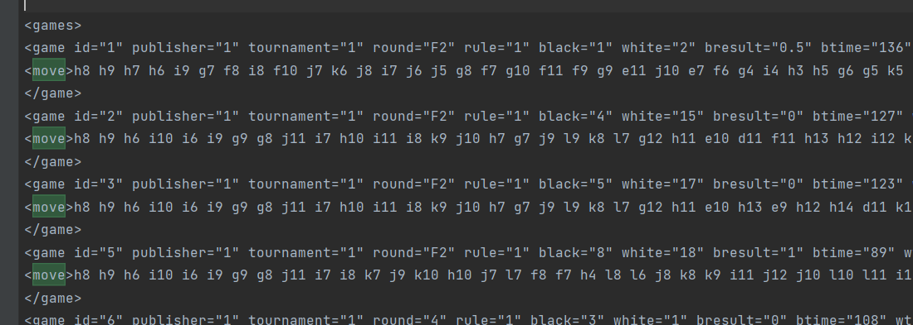
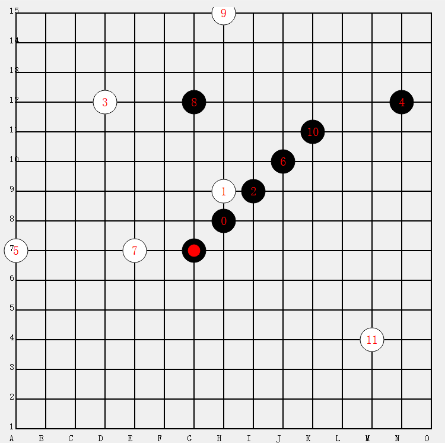

监督学习搞一个五子棋ai

## 获取数据集


这是一个xml文件，先进行数据预处理。



可以看到

对局信息是在games标签下game标签里的move标签中

 问问gpt如何提取信息...

```python
import xml.etree.ElementTree as ET

# 解析XML文件
tree = ET.parse('./renjunet_v10_20240128.rif')
root = tree.getroot()


# 获取所有游戏
games = root.findall(".//games/game")

for game in games[:1]:
    # 获取游戏的一些属性，例如ID和结果
    game_id = game.get('id')
    result_black = game.get('bresult')
    result_white = 1 - float(result_black)  # 计算白方的结果

    print(f"\n游戏ID：{game_id}")
    print(f"黑方结果：{result_black}")
    print(f"白方结果：{result_white}")

    # 获取游戏中的移动信息
    moves = game.find("./move").text.split()

    print("移动列表：", moves)

```

运行结果:

```
游戏ID：1
黑方结果：0.5
白方结果：0.5
移动列表： ['h8', 'h9', 'h7', 'h6', 'i9', 'g7', 'f8', 'i8', 'f10', 'j7', 'k6', 'j8', 'i7', 'j6', 'j5', 'g8', 'f7', 'g10', 'f11', 'f9', 'g9', 'e11', 'j10', 'e7', 'f6', 'g4', 'i4', 'h3', 'h5', 'g6', 'g5', 'k5', 'i5', 'f5', 'i3', 'i6', 'i2', 'i1', 'h11', 'i11', 'k10', 'l10', 'l5', 'k4', 'l4', 'l6', 'k9', 'k11', 'l9', 'l7', 'm9', 'j9', 'k8', 'k7', 'n7', 'm8', 'd7', 'e10', 'n6', 'n5', 'm7', 'l8', 'f12', 'h12', 'e13', 'g11', 'f13', 'f14', 'g13', 'h13', 'i13', 'c10', 'c12']

```


如下图，将棋盘从 (A,1)记作0，向上直到14， 接着(B,1)为15，依次类推



```python
import xml.etree.ElementTree as ET
import json


def alphabet_to_onedim(moves: list):
    """
    将形如   ['h8', 'h9', 'h7', 'h6', 'i9', 'g7', 'f8', 'i8]
    转换形如: [112, 113, 111, 110, 128, 96, 82, 127]
    """
    results = []
    for move in moves:
        x, y = move[0], move[1]
        res = (ord(x) - ord('a')) * 15 + int(y) - 1
        results.append(res)

    return results


def save_file(games_data):
    # 将数据保存到 JSON 文件
    output_filename = './data/games_data.json'
    with open(output_filename, 'w') as json_file:
        json.dump(games_data, json_file)

    print(f"提取的信息已保存到 '{output_filename}' 中。")


def load_file():
    input_filename = './data/games_data.json'
    with open(input_filename, 'r') as json_file:
        games_data = json.load(json_file)
        print(f"信息提取成功")
        return games_data


def parse_data():
    # 解析XML文件
    tree = ET.parse('./renjunet_v10_20240128.rif')
    root = tree.getroot()

    # 获取所有游戏
    games = root.findall(".//games/game")

    games_data = []
    for game in games:
        # 获取游戏的一些属性，例如ID和结果
        game_id = game.get('id')
        result = game.get('bresult')

        if game.find("./move").text is None:
            continue
        # 获取游戏中的移动信息
        moves = alphabet_to_onedim(game.find("./move").text.split())

        # 将信息添加到列表
        game_data = {
            "id": game_id,
            "result": result,
            "moves": moves
        }
        games_data.append(game_data)

    save_file(games_data)


parse_data()
print(load_file())
```


## 训练

构造特征棋盘:

```python
EMPTY = -1
WHITE = 0
BLACK = 1
# 游戏胜利与否的状态
CONTINUE = 2
NO_CLEAR_WINNER = 3  # 平局
# 棋盘大小
BOARD_LEN = 15
# 神经网络输入1*3*15*15的特征
FEATURE_LEN = 3


def history_to_feature(history):
    """
        返回向神经网络输入的特征 3*15*15
        3*15*15
        第一张15*15的棋盘是我方有棋子处为1，其余位置都为0
        第二张15*15的棋盘是对方有棋子处为1，其余位置都为0
        第三张15*15的棋盘是如果我方是黑方，全为-1，我方是白方，全为1
    """
    board = [EMPTY for i in range(BOARD_LEN * BOARD_LEN)]

    first_player = BLACK  # 我方  即 在当前回合下 该落子的一方
    for act in history:
        board[act] = first_player
        first_player = BLACK + WHITE - first_player

    feature = torch.zeros((FEATURE_LEN, BOARD_LEN, BOARD_LEN))

    for i in range(BOARD_LEN):
        for j in range(BOARD_LEN):
            pos = i * BOARD_LEN + j
            if board[pos] == first_player:
                feature[0][i][j] = 1
            elif board[pos] == WHITE + BLACK - first_player:
                feature[1][i][j] = 1
    if first_player == BLACK:
        feature[2] = -1
    elif first_player == WHITE:
        feature[2] = 1

    return feature

# his = [112, 113, 111, 110, 128, 96, 82, 127]
# feature = history_to_feature(his)
# print(feature)

```


构造dataset

先用3000盘数据训练下

```python
class RenjuDataset(Dataset.Dataset):
    def __init__(self):
        self.datas = []
        self.labels = []

        self.games_data = self.load_file()
        for game in self.games_data[:3000]:
            result = game['result']
            moves = game['moves']
            for i in range(3, (len(moves) - 1)):  # 从第三步开始起步  例如:疏星局开局
                board = moves[:i]
                feature = history_to_feature(board)
                p = torch.zeros(225, dtype=torch.float32)
                p[moves[i + 1]] = 1
                is_black = i % 2 == 0
                v = 0
                if result == 0.5:  # 黑棋平局视作输
                    v = -1 if is_black else 1
                elif result == 1:  # 黑棋胜
                    v = 1 if is_black else -1
                else:
                    v = -1 if is_black else 1
                v = torch.tensor(v, dtype=torch.float32)
                self.datas.append(feature)
                self.labels.append((p, v))

                # 90度旋转
                rotated_board_90 = torch.rot90(feature, k=1, dims=(1, 2))  # 3*15*15的张量   15*15的棋盘同时翻转
                rotated_pi_90 = torch.rot90(p.reshape((15, 15)), k=1).flatten()
                self.datas.append(rotated_board_90)
                self.labels.append((rotated_pi_90, v))

                # 180度旋转
                rotated_board_180 = torch.rot90(feature, k=2, dims=(1, 2))
                rotated_pi_180 = torch.rot90(p.reshape((15, 15)), k=2).flatten()
                self.datas.append(rotated_board_180)
                self.labels.append((rotated_pi_180, v))

                # 270度旋转
                rotated_board_270 = torch.rot90(feature, k=3, dims=(1, 2))
                rotated_pi_270 = torch.rot90(p.reshape((15, 15)), k=3).flatten()
                self.datas.append(rotated_board_270)
                self.labels.append((rotated_pi_270, v))

    def load_file(self):
        input_filename = './data/games_data.json'
        with open(input_filename, 'r') as json_file:
            games_data = json.load(json_file)
            print(f"信息提取成功")
            return games_data

    def __len__(self):
        """
        :return: 样本长度
        """
        return len(self.datas)

    def __getitem__(self, index):
        """
        :param index:
        :return: 返回datas的一个样本  (s,p,q)
        """
        s = self.datas[index]
        p, q = self.labels[index]

        if torch.cuda.is_available():
            device = torch.device("cuda")
            s = s.to(device)
            p = p.to(device)
            q = q.to(device)
        return s, p, q
```


找个model:

```python
import torch
import torch.nn as nn
import torch.nn.functional as f


class ResidualBlock(nn.Module):
    """
    残差块
    """

    def __init__(self, in_channel, out_channel):
        super(ResidualBlock, self).__init__()
        self.left = nn.Sequential(
            nn.Conv2d(in_channel, out_channel, kernel_size=3, stride=1, padding=1, bias=False),
            nn.BatchNorm2d(out_channel),
            nn.ReLU(inplace=True),  # inplace=True 参数表示在原地进行操作
            nn.Conv2d(out_channel, out_channel, kernel_size=3, stride=1, padding=1, bias=False),
            nn.BatchNorm2d(out_channel))
        self.right = nn.Sequential(
            # Use Conv2d with the kernel_size of 1, without padding to improve the parameters of the network
            nn.Conv2d(in_channel, out_channel, 1, stride=1, bias=False),
            nn.BatchNorm2d(out_channel))
        if torch.cuda.is_available():
            self.left.cuda()
            self.right.cuda()

    def forward(self, x):
        out = self.left(x)
        residual = x if self.right is None else self.right(x)
        out = out + residual
        return f.relu(out)


class RenjuModel(nn.Module):
    def __init__(self):
        super().__init__()
        self.BOARD_SIZE = 15
        self.layer1 = ResidualBlock(3, 12)
        self.layer2 = ResidualBlock(12, 48)
        self.layer3 = ResidualBlock(48, 64)
        self.layer4 = ResidualBlock(64, 64)

        # policy network
        self.layer1_p = ResidualBlock(64, 64)
        self.layer2_p = ResidualBlock(64, 16)
        self.policy_fc = nn.Linear(16 * self.BOARD_SIZE * self.BOARD_SIZE, 512)
        self.policy_batch_norm = nn.LayerNorm(512)
        self.policy = nn.Linear(512, self.BOARD_SIZE * self.BOARD_SIZE)
        # value network
        self.layer1_v = ResidualBlock(64, 64)
        self.layer2_v = ResidualBlock(64, 16)
        self.value_fc = nn.Linear(16 * self.BOARD_SIZE * self.BOARD_SIZE, 64)
        self.value_batch_norm = nn.LayerNorm(64)
        self.value = nn.Linear(64, 1)

        if torch.cuda.is_available():
            self.policy_fc.cuda()
            self.policy_batch_norm.cuda()
            self.policy.cuda()
            self.value_fc.cuda()
            self.value_batch_norm.cuda()
            self.value.cuda()

    def forward(self, x):
        x = x.reshape(-1, 3, self.BOARD_SIZE, self.BOARD_SIZE)
        x = self.layer1(x)
        x = self.layer2(x)
        x = self.layer3(x)
        x = self.layer4(x)

        # policy network
        pi = self.layer1_p(x)
        pi = self.layer2_p(pi)
        pi = pi.view(-1, 16 * self.BOARD_SIZE * self.BOARD_SIZE)
        pi = self.policy_fc(pi)
        pi = f.relu(self.policy_batch_norm(pi))
        pi = f.softmax(self.policy(pi), dim=1)
        # value network
        v = self.layer1_v(x)
        v = self.layer2_v(v)
        v = v.view(-1, 16 * self.BOARD_SIZE * self.BOARD_SIZE)
        v = self.value_fc(v)
        v = f.relu(self.value_batch_norm(v))
        v = torch.tanh(self.value(v))
        return pi, v


if __name__ == "__main__":
    input = torch.zeros((1, 3, 15, 15))
    if torch.cuda.is_available():
        input = input.to('cuda')
    model = RenjuModel()
    pi, v = model(input)
    print(pi.shape, v.shape)
    print(pi)
    print(model)

```


训练该网络

```python
import os

import torch
from torch import nn
from torch.utils.data import dataloader

from model import RenjuModel
from renju_dataset import RenjuDataset


class TrainNet:
    def __init__(self, model_path):
        self.model_path = model_path
        # model
        if os.path.exists(self.model_path):
            self.model = torch.load(self.model_path)
            print(f"已经加载{self.model_path}处模型")
        else:
            self.model = RenjuModel()
            print("初始化模型")
        self.init_weight()  # 初始化模型参数
        if torch.cuda.is_available():
            # 把模型放置 device
            self.model = self.model.to(device=torch.device("cuda"))

        # loss
        self.loss_pi = torch.nn.CrossEntropyLoss()  # 用于策略损失
        self.loss_q = torch.nn.MSELoss(reduction='mean')  # 用于价值损失

        # optimizer
        self.optimizer = torch.optim.Adam(self.model.parameters(), lr=0.001, weight_decay=0.0001)  # 优化器Adam可动态调整学习率

    def init_weight(self):
        """
        Initialize network parameters
        对于 nn.Conv2d 模块（卷积层），使用 Kaiming 初始化方法，其中权重使用正态分布，偏置初始化为0。
        对于 nn.BatchNorm2d 模块（批归一化层），将权重初始化为1，偏置初始化为0。
        对于 nn.Linear 模块（全连接层），使用正态分布初始化权重，偏置初始化为0.01。
        """
        for m in self.model.modules():
            if isinstance(m, nn.Conv2d):
                nn.init.kaiming_normal_(m.weight, mode='fan_out', nonlinearity='relu')
                if m.bias is not None:
                    nn.init.constant_(m.bias, 0)
            elif isinstance(m, nn.BatchNorm2d):
                nn.init.constant_(m.weight, 1)
                if m.bias is not None:
                    nn.init.constant_(m.bias, 0)
            elif isinstance(m, nn.Linear):
                nn.init.normal_(m.weight, 0, 0.01)
                if m.bias is not None:
                    nn.init.constant_(m.bias, 0)

    def train(self, start_epoch, epochs, early_stopping_patience=5):
        renju_dataset = RenjuDataset()

        train_size = int(len(renju_dataset) * 0.8)
        validate_size = int(len(renju_dataset) * 0.2)
        test_size = len(renju_dataset) - validate_size - train_size
        train_dataset, validate_dataset, test_dataset = torch.utils.data.random_split(renju_dataset,
                                                                                      [train_size, validate_size,
                                                                                       test_size])

        # input在dataloader内部 放置到cuda上
        train_dataloader = dataloader.DataLoader(train_dataset,
                                                 batch_size=64,
                                                 shuffle=True,
                                                 num_workers=0)  # 需注意 在windows中num_workers只能是0，在linux中才能多进程

        validate_dataloader = dataloader.DataLoader(validate_dataset,
                                                    batch_size=64,
                                                    shuffle=True,
                                                    num_workers=0)  # 需注意 在windows中num_workers只能是0，在linux中才能多进程
        print("dataloader加载成功")
        best_validation_loss = float('inf')
        patience_counter = 0

        self.model.train()
        for epoch in range(epochs):
            for i, item in enumerate(train_dataloader):
                s, p, q = item

                # forward
                predict_p, predict_q = self.model(s)
                # print(p.shape)
                # print(predict_p.view(-1))
                loss_pi = self.loss_pi(predict_p, p)

                loss_q = self.loss_q(predict_q.view(-1), q)  # 使用view将张量展平  即 [2,1] -> 2

                # backward
                self.optimizer.zero_grad()
                total_loss = loss_pi + loss_q
                total_loss.backward()
                self.optimizer.step()

                # Print or log the loss during training
                if (i + 1) % 200 == 0:
                    print(f'Epoch [{epoch + 1}/{epochs}], Step [{i + 1}/{len(train_dataset)}], '
                          f'Loss_pi: {loss_pi.item():.4f}, Loss_q: {loss_q.item():.4f},total_loss:{total_loss:6.4f}\n"')

                # 保存loss
                with open("log" + os.sep + "loss.txt", "a") as file_point:
                    file_point.write(f"pi_loss:{loss_pi:6.3f}, q_loss:{loss_q:6.3f}, total_loss:{total_loss:6.4f}\n")
            print(f"Epoch {epoch + 1}/{epochs} completed.")

            # 在验证集上计算损失
            validation_loss = self.calculate_validation_loss(validation_dataloader=validate_dataloader)

            # 保存最好的模型
            if validation_loss < best_validation_loss:
                best_validation_loss = validation_loss
                torch.save(self.model, f"model" + os.sep + f"best_model.pt")
                patience_counter = 0
            else:
                patience_counter += 1

            print(f"Epoch {epoch + 1}/{epochs}, Validation Loss: {validation_loss:.4f}")

            # 判断是否早停
            if patience_counter >= early_stopping_patience:
                print("Early stopping: No improvement in validation loss for {} epochs.".format(patience_counter))
                break

        # 保存模型
        torch.save(self.model, f"model" + os.sep + f"train_model{start_epoch + epochs}_end.pt")

    def calculate_validation_loss(self, validation_dataloader):
        self.model.eval()
        total_loss = 0.0
        with torch.no_grad():
            for i, item in enumerate(validation_dataloader):  # 使用验证集的dataloader
                s, p, q = item
                predict_p, predict_q = self.model(s)
                loss_pi = self.loss_pi(predict_p, p)
                loss_q = self.loss_q(predict_q.view(-1), q)
                total_loss += (loss_pi + loss_q).item()
        return total_loss / len(validation_dataloader)

    def predict(self, x):
        self.model.eval()
        with torch.no_grad():
            p, q = self.model(x)
        return p, q


train = TrainNet("./model/model.pt")
train.train(0, epochs=10)  # 训练20轮

```


测试.pt文件

