# 若依

若依脚手架，已经实现的功能模块有5个：

1.首页

2.系统管理

3.系统监控

4.系统工具

表单构建（生成vue文件）

代码生成（生成sql、crud的前后端代码）

系统接口（测试）

5.个人中心

---

## 1.熟悉项目

 ### 1.1后端模块结构

admin : 存放controller

common : 存放工具类

framework: 存放第三方框架代码和配置

generator: 代码生成器模块

quartz: 定时任务模块

system: 存放domain、mapper、service

运行时将会把common 、framework等打成jar包，

然后admin取得这些jar包依赖即可。

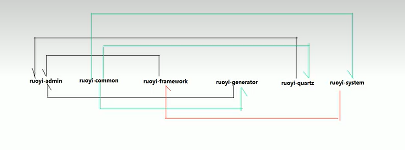

### 1.2表结构

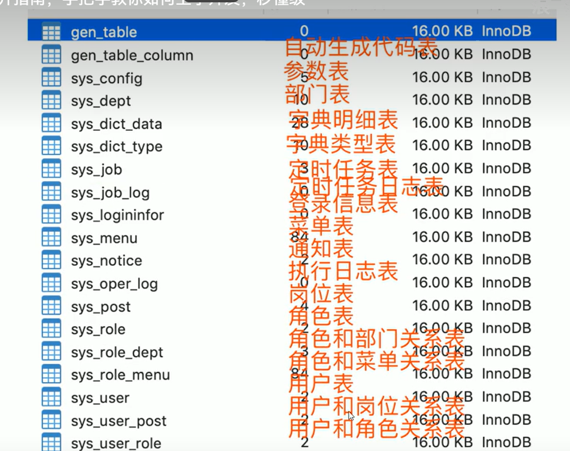

### 1.3项目配置

主要就是admin下的配置

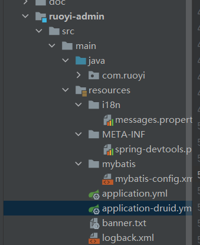

### 1.4返回值

后端返回json格式

TableDataInfo（分页列表时用这个格式）

AjaxResult (继承hashmap ，基本添加编辑操作用这个格式)

void（导出下载时无需格式）

---

## 2.分析模块

前提:  前端：vue   后端：ssm

常规项目特点： 先页面，后接口

**web项目组件解读技巧**

`主线：发起请求--> 接受请求 --> 处理请求 --> 响应请求`

· 客户端如何发请求: url、请求方式、请求头、请求参数

· 接口接受请求：接口定义、参数接受、参数封装、校验

· 接口处理请求：业务逻辑实现

· 接口响应请求：响应数据格式、响应头

### 岗位管理

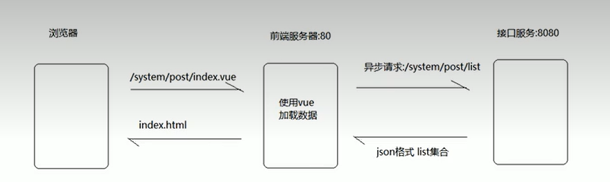

vue做了路由映射

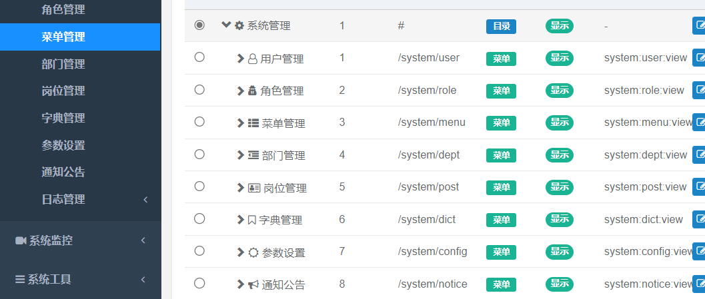

页面大致五个部分

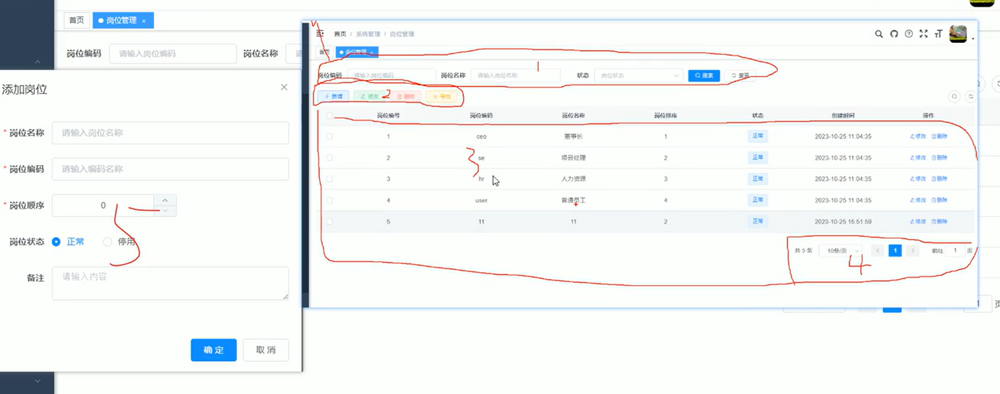

对应 .vue文件中 刚好

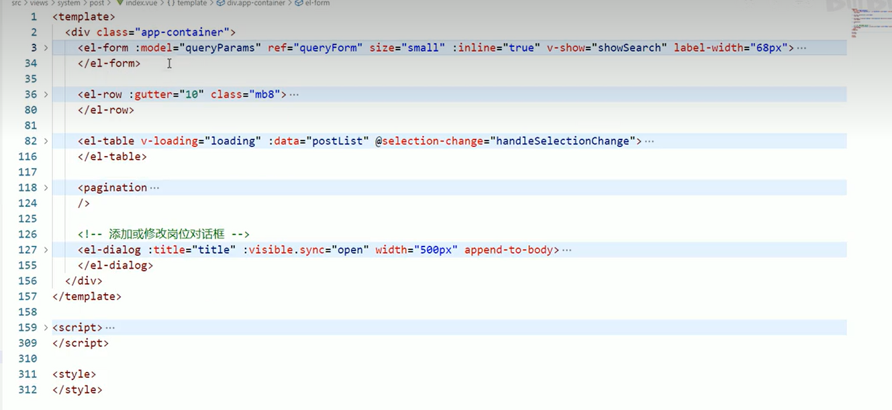

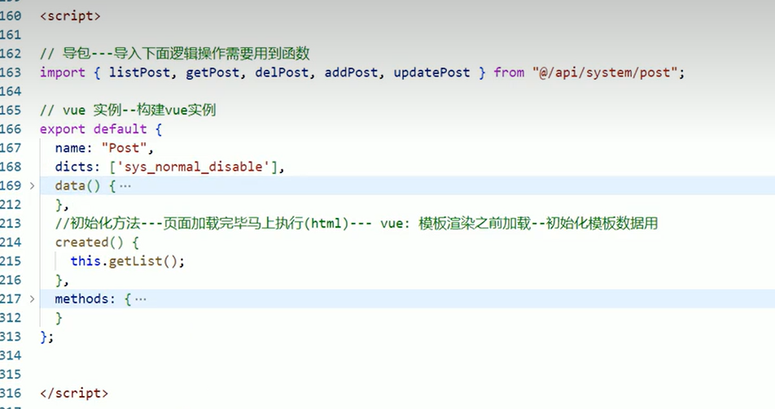

### 2.1.1岗位列表

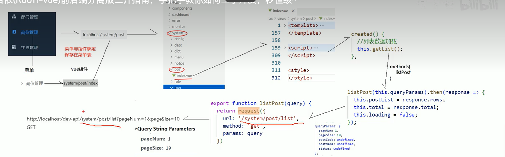

### 2.1.2 请求路径处理

`当一个请求url的协议、域名、端口三者之间任意一个与当前页面url不同即为跨域`

为了解决跨域问题：前后端通信做了路径处理

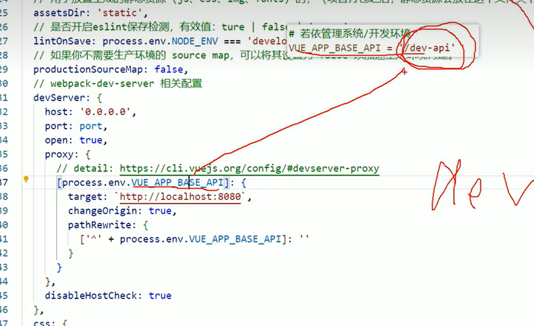

代理服务器：

将vue前端所有以 /dev-api 为前缀的请求转发到 localhost:8080

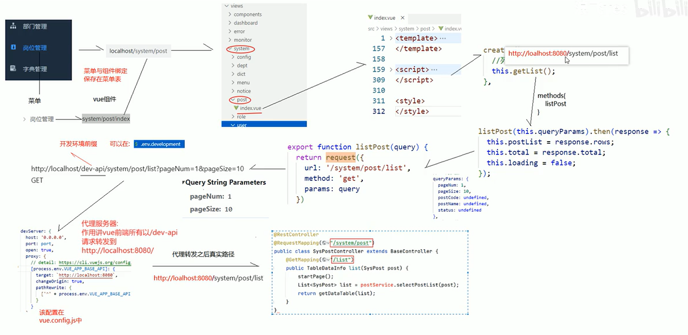

### 2.1.3 接口处理

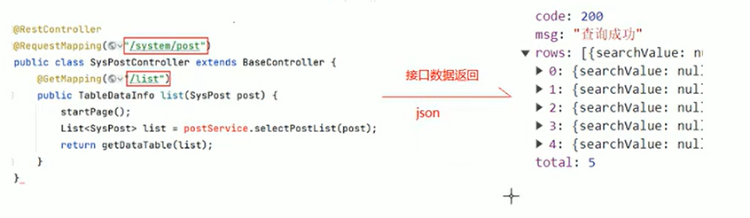

 ### 2.1.4 接口返回

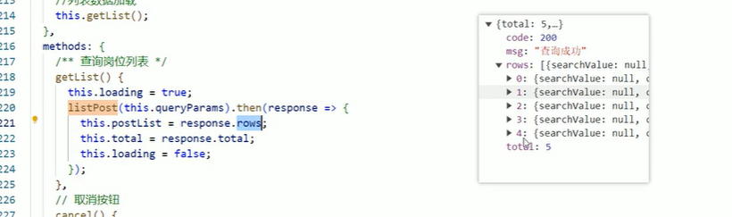

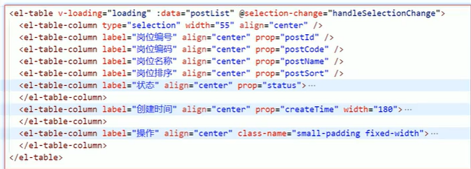

### 

 前后端都要校验
前端校验是给用户看到
使用postman可以测试非法数据，后端校验是干这个用的

...

## 3 crud

### 3.1 手动版

目录对应

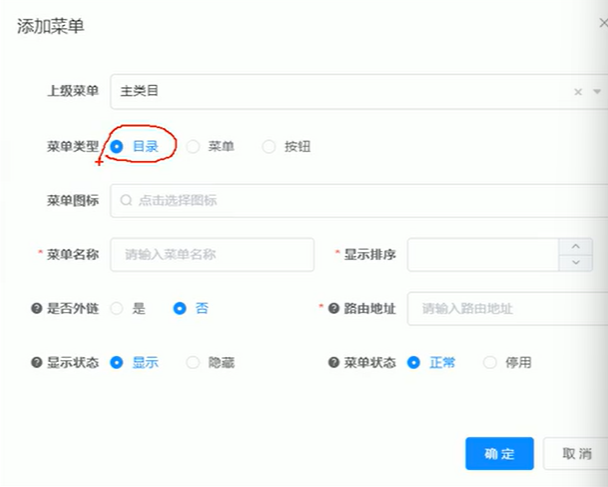

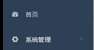

菜单对应

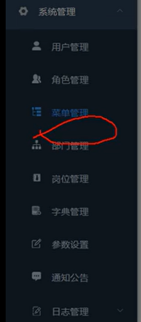

注意路由地址  是浏览器显示的路径

而组件路径，是vue中views下对应的路径，即前端具体页面路径

### 3.2 代码生成器

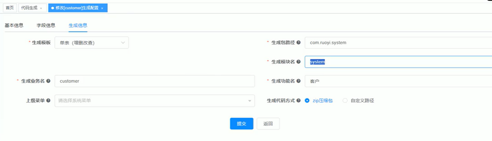

生成包路径，该路径下有 domain、mapper、sevice

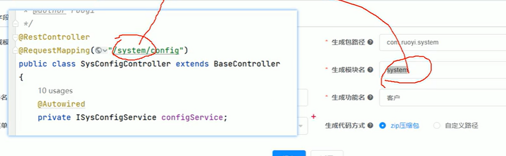

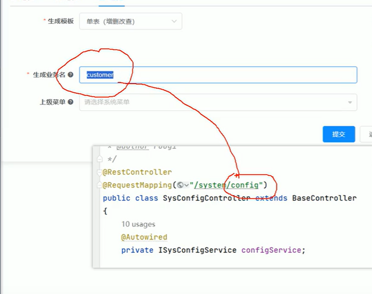

选择完毕后得到压缩包：

1. 运行sql
2. 拷贝 domain、mapper、service到 com.ruoyi.system ,  xml映射文件拷贝到同级resource目录下、 controller拷贝到ruoyi-admin下
3. 拷贝api，views到对应src下

ok!!!

[《若依ruoyi》第十一章：Ruoyi 代码生成工具详解-操作界面 - 知乎 (zhihu.com)](https://zhuanlan.zhihu.com/p/644059537)
